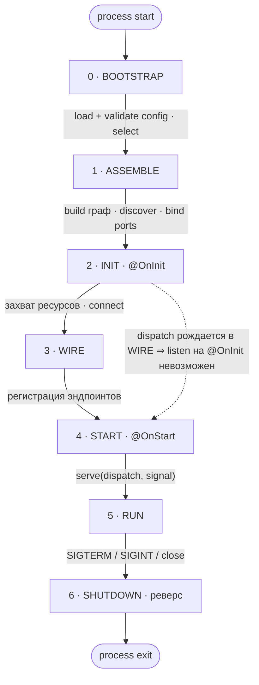

# Composition root и жизненный цикл

🚧 **Статус: дизайн (целевое состояние).** Существует сегодня: `App`,
`makeAppModule`/`makeModule`, `@HttpEndpoint`/`makeEndpoint`, `Ok`/`Fail`,
`compose`/`makePipeline`, `meta.signal`. Проектируется (помечено `proposed`):
`assemble`, `makeFeature` + `select`, `makeContract` + порты, config-модуль,
транспорты-как-провайдеры, фазы `@OnStart`/go-live. Документ фиксирует, как эти
слои складываются в один жизненный цикл и один composition root.

---

## 1. Жизненный цикл



**Что происходит в каждой фазе:**

- **0 · BOOTSTRAP** (контейнера ещё нет) — load env / file / Vault
  (единственная точка `process.env`) → validate assembly- и provider-config
  *выбранных* фич → `✗ invalid → FAIL-FAST` (источник моргает → bounded retry,
  потом смерть). Выдаёт `select`, config-значения, policy.
- **1 · ASSEMBLE** (граф строится) — `select` → какие модули идут в билдер;
  discover из дерева модулей (не глобальный registry): providers · endpoints ·
  transports; `build()` жадно (инстанциация · циклы · топосорт); bind ports
  (local | remote поверх шины | `✗ FAIL-FAST`).
- **2 · INIT** (`@OnInit`, топологически) — захват ресурсов: DB-пул, connect
  NATS. Транспорты подключены, **не в эфире**. `dispatch` ещё не существует.
- **3 · WIRE** — endpoints → instance из контейнера; таблица `pattern→handler`
  на транспорт. **`dispatch` рождается здесь.**
- **4 · START** (`@OnStart`, топологически) — `serve(dispatch, signal)`, не
  `listen()`. HTTP слушает сокет, NATS — `subscribe` (queue-group для реплик).
- **5 · RUN** — `port.call` / `emit` → local | bus (по policy); live config-refs
  обновляются (opt-in).
- **6 · SHUTDOWN** (обратный порядок) — stop serving (реверс START) → abort
  in-flight (`meta.signal` → хендлеры и подписки) → `@OnDestroy` (реверс
  топосорта): close пулы, disconnect.

**Инварианты, которые кодирует схема:**

| Инвариант | Фаза |
|---|---|
| `process.env` трогается только в config | 0 |
| дискавери из дерева модулей, не глобальный registry | 1 |
| транспорты — провайдеры, не мешок в конструкторе | 1 |
| port-биндинг вычисляется из графа, не внешний конфиг | 1 |
| **`dispatch` рождается в фазе 3 ⇒ ранний `listen` невозможен** (гарантия, не конвенция) | 2→3→4 |
| fail-fast: конфиг (0) и биндинг / недостающий транспорт (1) | 0, 1 |
| `select` — единственный неснимаемо-внешний вход | 0→1 |
| START по топосорту, SHUTDOWN строго в реверсе | 4 ↔ 6 |

Ось всей защиты от «listen на `@OnInit`» — `dispatch` рождается строго между
INIT и START. Слить WIRE в ASSEMBLE нельзя: `dispatch` станет доступен слишком
рано и гарантия сломается. Порядок 2→3→4 — несущий.

---

## 2. Машинерия фич — опциональна (прогрессивное раскрытие)

Главный принцип: **приложение из одной фичи выглядит так, будто фич нет вообще.**
Каждый слой — аддитивный; нижние уровни не меняются, когда подключаешь верхние.

| Уровень | Что добавляешь | Чего ещё нет |
|---|---|---|
| **L0** | модули + транспорт | features, select, config-модуль, порты, шина |
| **L1** | типизированный config-модуль | features, select, порты, шина |
| **L2** | `makeFeature` + `select` (`--features=all\|subset`) | порты, шина — всё co-located |
| **L3** | `makeContract` + порты (co-located) | шина — in-proc dispatch |
| **L4** | NATS-транспорт + `dispatch`-policy | — split-развёртывание |

Ключевое: **код фич и эндпоинтов между L3 и L4 не меняется.** Разнесение по
процессам — это разница в composition root и конфиге, не в бизнес-коде. И L0
нигде не упоминает `feature`/`port`/`select` — за них не платишь, пока они не
нужны.

Composition root — это одна функция `assemble(...)` с опциональными полями.
Простой случай игнорирует всю машинерию:

```typescript
// сигнатура (proposed) — надстройка над сегодняшним new App({ modules, transports })
assemble({
  modules?,     // L0
  config?,      // L1  привязка источников: [[src, targets]]; env — неявный пол (kernel)
  features?,    // L2
  select?,      // L2
  transports?,  // L0+ (провайдеры транспортов; sugar регистрирует их в граф)
  plugins?,     // L1+ ambient cross-cutting (тонкий root-bag; feature-scoped инфра едет с фичей)
  dispatch?,    // L4  'local-first' | 'always-remote' | 'balanced'
}): App         // → app.run()
```

Ниже — одна и та же прогрессия L0→L4 в двух стилях. Обрати внимание: **сам
`assemble(...)` почти идентичен в обоих**; различаются строительные блоки
(классы+декораторы против `make*`+factory-провайдеров), а не корень.

---

## 3. User space / kernel space

Граница между тем, что пишет пользователь, и тем, чем владеет фреймворк — как
между user space и kernel space в ОС.

- **Kernel space** (привилегированное, токены **не** экспортируются):
  `ConfigSource` (слитый слой источников), транспорты, bus / port-client
  внутренности, машинерия графа и lifecycle.
- **User space** (то, что пишешь ты): сервисы, endpoints, контракты,
  конфиг-как-данные.

Границу пересекаешь только через публичные абстракции — «системные вызовы»:

| User space хочет | «syscall» | Kernel делает |
|---|---|---|
| значение конфига | инжект `Config<typeof X>` | читает из `ConfigSource`, валидирует |
| позвать другую фичу | `Port<C>.call` / `Emitter<C>.emit` | local dispatch или транспорт |
| принять запрос | вернуть / `yield` из endpoint | сокет / subscribe |

**Enforcement — не рантайм-ACL, а видимость ES-модулей:** kernel-токены не
экспортируются, поэтому из user space их физически нечем инжектить (ideas.md,
решение 3). Границу пересекаешь только там, где фреймворк поставил дверь.

**Зачем:** user-space код провенанс-слеп и транспорт-слеп → тот же бизнес-код
работает локально или в split, с конфигом из env или vault, без правок. Kernel
поглощает окружение; user space остаётся чистым.

### Конфигурация: секции + одна центральная читалка (token-families)

Модель конфига — **финальная (2026-07-08): конфиг как token-families,
`sources`/merged-`Vars` убраны.** Полная логика — [ideas.md](../decisions/ideas.md)
(«Kernel/user space; конфиг как token-families») и
[discussions/05 §15](../history/discussions/05-modular-monolith-features-ports.md).

Секция объявляется `makeConfig('prefix', schema)`: префикс строит имя ключа
(`maxItems` → `ORDERS_MAX_ITEMS`), `from('KEY')` задаёт точное имя. **Источник не
называется** — секция (user space) провенанс-слепа: читает ключ, не зная, откуда
пришло значение (syscall-граница, как чтение `fd`). Владеет секцией модуль
(`configs: [OrdersConfig]`); инжект секции **чужим** модулем → ошибка на `build()`
(структурная, ловится в любом тесте/CI).

Источники — **не провайдеры**, а объекты `ConfigSource { get; init?; close?; watch? }`
в одной приватной читалке (kernel). `env` — неявный пол; свои координаты (`path`,
`addr`) источник читает из примордиального `process.env` в `init()` (единственный
контакт с `process.env`). Привязка — в корне, плоским списком `config: [[src, targets]]`,
порядок = приоритет; **прогрессивно**: только `.env` → про конфиг в корне ничего не
пишешь.

```typescript
// секция — только схема + ключи, источник не называется
export const OrdersConfig = makeConfig('orders', z.object({
  maxItems:    z.coerce.number().default(100),   // ← ключ ORDERS_MAX_ITEMS
  databaseUrl: from('DATABASE_URL', z.url()),     // общий ключ, без префикса
}));

// модуль владеет секцией:
//   makeAppModule({ name: 'module:orders', providers: [...], configs: [OrdersConfig] })

// корень: только env → про конфиг ничего; появился второй источник → привязываешь
await assemble({
  modules: [OrdersModule],
  transports: [http()],                            // порт — из HttpConfig, не литерал
}).run();
// с vault/файлом:  config: [[vault(), [OrdersConfig]], [file('config.yaml'), ['*_URL']]]
```

Жадный контейнер инстанцирует все секции выбранных фич на `build()` → валидация
eager → **невалидный конфиг на старте = FAIL-FAST**.

### Reloadable-конфиги

Источник с наблюдением (`reloadableFile`, `vault({ watch: true })`) на изменение
даёт читалке новое значение, и та пере-проецирует reloadable-секции: инстанс
стабилен, поля обновляются на месте. Два способа потребления:

```typescript
export const Runtime = makeConfig.reloadable('runtime', z.object({
  logLevel: z.enum(['debug', 'info', 'warn', 'error']).default('info'),
  rps:      z.coerce.number().default(100),
}));

// (а) read-latest — читаем при каждом использовании, подписка не нужна
@Injectable([Runtime])
class Logger {
  constructor(private cfg: Config<typeof Runtime>) {}
  debug(m: string) { if (gte(this.cfg.logLevel, 'debug')) this.write(m); }
}

// (б) react — надо перестроить ресурс при изменении
@Injectable([Runtime])
class RateLimiter {
  #bucket = new TokenBucket(100);
  constructor(private cfg: Config<typeof Runtime>) {}
  @OnStart() start(signal: AbortSignal) {
    this.#bucket.refill(this.cfg.rps);
    this.cfg.onChange(signal, (next) => this.#bucket.refill(next.rps)); // отписка по signal
  }
}

// корень: reloadable-источник — то, что вообще включает reload
await assemble({ config: [[reloadableFile('runtime.yaml'), [Runtime]]], /* ... */ }).run();
```

Две асимметрии со стартом:

- **старт: невалидный конфиг → die; reload: невалидный → keep last-good + warn.**
  Живой процесс не падает из-за плохого горячего значения.
- **вступит ли изменение в силу — ответственность потребителя.** read-latest и
  `onChange` — да; значение, захваченное один раз в конструкторе (URL пула) — нет.
  Поэтому reloadable — opt-in, только для значений, которые кто-то честно
  перечитывает или на которые реагирует.

---

## 4. Классический стиль (классы + декораторы)

### L0 — одна фича, как будто фич нет

```typescript
// orders.service.ts
@Injectable([])
export class OrdersService {
  create(dto: NewOrder): Order { /* ... */ }
}

// create-order.endpoint.ts
@Injectable([OrdersService])
@HttpEndpoint('POST', '/orders', {
  input: NewOrder,
  output: Order,
  pipeline: basePipeline,
})
export class CreateOrderEndpoint implements IEndpoint {
  constructor(private orders: OrdersService) {}
  async handle(input: NewOrder): Output<Order> {
    return new Ok(this.orders.create(input));
  }
}

// orders.module.ts
export const OrdersModule = makeAppModule({
  name: 'module:orders',
  providers: [OrdersService],
  endpoints: [CreateOrderEndpoint],
});

// main.ts — composition root
await assemble({
  modules: [OrdersModule],
  transports: [http({ port: 3000 })],
}).run();
```

Ни `feature`, ни `select`, ни `port`. Это сегодняшний
`new App({ modules, transports })`, только транспорт — провайдер.

### L1 — + типизированный config (никакого `process.env` в коде)

Источники — в корне (kernel), секция — только схема + ключи, source-agnostic
(см. §3). `OrdersConfig` авто-дискаверится из провайдера, который его инжектит.

```typescript
// orders.config.ts — секция: схема + ключи, БЕЗ источников
export const OrdersConfig = makeConfig('orders', z.object({
  maxItems:    z.coerce.number().default(100),   // ← ключ ORDERS_MAX_ITEMS
  databaseUrl: from('DATABASE_URL', z.url()),     // общий ключ, без префикса
}));

// orders.service.ts — конфиг инжектится типизированным срезом
@Injectable([OrdersConfig])
export class OrdersService {
  constructor(private cfg: Config<typeof OrdersConfig>) {}
  create(dto: NewOrder): Order {
    if (dto.items.length > this.cfg.maxItems) throw Fail.badRequest('too many');
    /* ... */
  }
}

// orders.module.ts — модуль владеет секцией: configs: [OrdersConfig]
// main.ts — только env → про конфиг в корне ничего (env — неявный пол; валидация eager → FAIL-FAST)
await assemble({
  modules: [OrdersModule],
  transports: [http({ port: 3000 })],
}).run();
// появился второй источник → привязываешь: config: [[file('config.yaml'), [OrdersConfig]]]
```

### L2 — + features + select (модульный монолит с выбором)

```typescript
// features.ts
export const OrdersFeature  = makeFeature({ name: 'orders',  modules: [OrdersModule] });
export const BillingFeature = makeFeature({ name: 'billing', modules: [BillingModule] });

// config.ts — select читается в bootstrap (фаза 0, до контейнера), source-agnostic
export const RootConfig = makeConfig('', z.object({
  FEATURES: z.string().default('all'), // 'all' | 'orders,billing'
}));

// main.ts — load() делает примордиальное чтение select (env, фаза 0) до контейнера
const cfg = await load(RootConfig);
await assemble({
  features: [OrdersFeature, BillingFeature],
  select: cfg.FEATURES,          // 'all' локально, 'orders' в отдельном поде
  transports: [http({ port: 3000 })],
}).run();
```

Не выбрал фичу → её провайдеры не построились (жадный контейнер), её эндпоинтов
нет (дискавери из дерева выбранных модулей). Всё ещё один процесс, шина не нужна.

### L3 — + контракт + порт (co-located, in-proc)

```typescript
// billing/contracts.ts — владеет billing, импортируют потребители
export const ChargeCard = makeContract({
  name: 'billing.charge',
  kind: 'request',                       // request-reply, Fail-able
  input:  z.object({ orderId: z.string(), amount: z.number() }),
  output: z.object({ chargeId: z.string() }),
});

// billing — реализует контракт (endpoint на messaging-транспорте)
@Injectable([PaymentGateway])
@ContractEndpoint(ChargeCard)
export class ChargeCardEndpoint implements Handler<typeof ChargeCard> {
  constructor(private gw: PaymentGateway) {}
  async handle(input, meta) {
    return new Ok({ chargeId: await this.gw.charge(input, meta.signal) });
  }
}

// orders — потребляет порт (не знает, локальный billing или за сетью)
@Injectable([OrdersService, ChargeCard.port])
@HttpEndpoint('POST', '/orders', { input: NewOrder, output: Order, pipeline: basePipeline })
export class CreateOrderEndpoint implements IEndpoint {
  constructor(private orders: OrdersService, private billing: Port<typeof ChargeCard>) {}
  async handle(input: NewOrder, meta): Output<Order> {
    const charge = await this.billing.call({ orderId: input.id, amount: input.total }, meta);
    if (charge.isFail) return charge;    // отказ — нормальный Fail, не исключение
    return new Ok(this.orders.create(input));
  }
}

// main.ts — не изменился с L2: биндинг порта вычисляется из графа.
// billing выбран → ChargeCard.port биндится на локальный хендлер (in-proc).
```

### L4 — + NATS + dispatch-policy (split, тот же код фич)

```typescript
// main.ts — меняется ТОЛЬКО корень и конфиг, не эндпоинты
const cfg = await load(RootConfig);      // примордиально — только select
await assemble({
  features: [OrdersFeature, BillingFeature],
  select: cfg.FEATURES,                  // 'orders' здесь, 'billing' в другом поде
  transports: [
    http(),
    nats(),                              // outbound-транспорт для портов
  ],                                     // порт/servers — из Http/NatsConfig (env: HTTP_PORT, NATS_SERVERS)
  dispatch: 'local-first',               // co-located → in-proc, иначе → NATS
}).run();
```

`select='orders'` + billing не выбран → `ChargeCard.port` биндится на remote-клиент
поверх NATS; billing в своём поде экспонирует `billing.charge` (queue-group для
реплик). `select='all'` без NATS → всё co-located, порт локальный. Один бинарник,
разные топологии — за счёт конфига.

---

## 5. Функциональный стиль (`make*` + factory-провайдеры)

Тот же прогресс, без классов и декораторов. Сервисы — фабрики за токенами,
эндпоинты — `makeEndpoint`, DI — через `factoryProvider(token, factory, deps)`.

### L0

```typescript
// orders.service.ts
export const OrdersService = token<{ create(dto: NewOrder): Order }>('orders.service');
export const makeOrdersService = () => ({ create: (dto: NewOrder) => ({ /* ... */ }) });

// create-order.endpoint.ts — фабрика замыкает зависимости
export const CreateOrder = token('orders.create-order');
export const makeCreateOrder = (orders: Infer<typeof OrdersService>) =>
  makeEndpoint({
    transport: 'http',
    pattern: 'POST /orders',
    input: NewOrder,
    output: Order,
    pipeline: basePipeline,
    handle: async (input: NewOrder) => new Ok(orders.create(input)),
  });

// orders.module.ts
export const OrdersModule = makeModule({
  name: 'module:orders',
  providers: [
    factoryProvider(OrdersService, makeOrdersService, []),
    factoryProvider(CreateOrder, makeCreateOrder, [OrdersService]), // endpoint как провайдер
  ],
});

// main.ts — корень идентичен классическому
await assemble({
  modules: [OrdersModule],
  transports: [http({ port: 3000 })],
}).run();
```

### L1 — + config

```typescript
// секция конфига — то же значение, что в классическом стиле
export const OrdersConfig = makeConfig('orders', z.object({
  maxItems: z.coerce.number().default(100),
}));

export const makeOrdersService = (cfg: Config<typeof OrdersConfig>) => ({
  create: (dto: NewOrder) => {
    if (dto.items.length > cfg.maxItems) throw Fail.badRequest('too many');
    return { /* ... */ };
  },
});

export const OrdersModule = makeModule({
  name: 'module:orders',
  configs: [OrdersConfig],              // владение секцией
  providers: [
    factoryProvider(OrdersService, makeOrdersService, [OrdersConfig]),
    factoryProvider(CreateOrder, makeCreateOrder, [OrdersService]),
  ],
});

// только env → про конфиг в корне ничего; второй источник → config: [[file('config.yaml'), [OrdersConfig]]]
await assemble({
  modules: [OrdersModule],
  transports: [http({ port: 3000 })],
}).run();
```

### L2 — + features + select

```typescript
export const OrdersFeature  = makeFeature({ name: 'orders',  modules: [OrdersModule] });
export const BillingFeature = makeFeature({ name: 'billing', modules: [BillingModule] });

const cfg = await load(RootConfig);      // примордиально — только select
await assemble({
  features: [OrdersFeature, BillingFeature],
  select: cfg.FEATURES,
  transports: [http({ port: 3000 })],
}).run();
```

### L3 — + контракт + порт (co-located)

```typescript
// контракт — то же значение, что и в классическом стиле
export const ChargeCard = makeContract({
  name: 'billing.charge', kind: 'request',
  input:  z.object({ orderId: z.string(), amount: z.number() }),
  output: z.object({ chargeId: z.string() }),
});

// billing реализует функционально
export const makeChargeCard = (gw: Infer<typeof PaymentGateway>) =>
  implement(ChargeCard, async (input, meta) =>
    new Ok({ chargeId: await gw.charge(input, meta.signal) }));

// orders потребляет порт — порт как обычная зависимость фабрики
export const makeCreateOrder = (
  orders: Infer<typeof OrdersService>,
  billing: Port<typeof ChargeCard>,
) =>
  makeEndpoint({
    transport: 'http', pattern: 'POST /orders',
    input: NewOrder, output: Order, pipeline: basePipeline,
    handle: async (input, meta) => {
      const charge = await billing.call({ orderId: input.id, amount: input.total }, meta);
      if (charge.isFail) return charge;
      return new Ok(orders.create(input));
    },
  });

// в модуле: factoryProvider(CreateOrder, makeCreateOrder, [OrdersService, ChargeCard.port])
// main.ts — не изменился с L2
```

### L4 — + NATS + policy

```typescript
const cfg = await load(RootConfig);      // примордиально — только select
await assemble({
  features: [OrdersFeature, BillingFeature],
  select: cfg.FEATURES,
  transports: [http(), nats()],          // порт/servers — из Http/NatsConfig
  dispatch: 'local-first',
}).run();
```

Идентично классическому L4 — потому что composition root оперирует значениями
(features, transports, config), а не стилем их внутренней реализации.

---

## Что из этого следует для реализации

- **Фикс дискавери** (эндпоинты/транспорты из дерева модулей, не из глобального
  registry) — предпосылка для L2+: без него невыбранная фича всё равно
  «протекает» в приложение. См. [roadmap](../decisions/roadmap.md).
- **`@OnStart` / go-live-фаза** — предпосылка для гарантии `dispatch` (WIRE между
  INIT и START).
- **Порты (L3/L4)** — самый большой слой; L0–L2 можно доставить раньше и
  независимо. In-proc-биндинг (L3) проверяется без NATS.
- Порядок в roadmap: config-модуль → фикс дискавери + `makeFeature`/`select` →
  `@OnStart` → `makeContract` + порты (in-proc) → `@nestling/transport.nats`.
