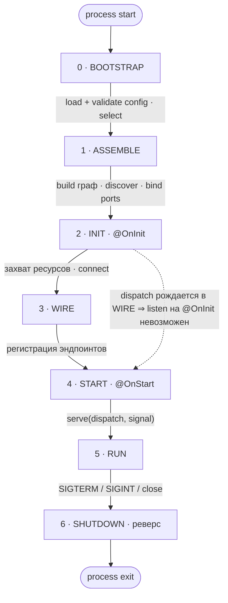

# Composition root и жизненный цикл

> **Целевое состояние V1.** Логика решений: [ideas.md](../decisions/ideas.md) —
> «Модульный монолит: фичи, `select`, дискавери из дерева модулей» [2026-07-08],
> «Жизненный цикл: фазы, `@OnStart`/go-live, гарантия `dispatch`» [2026-07-08],
> «Kernel/user space; конфиг как token-families» [2026-07-08],
> «Policy-check на собранном графе» [2026-07-14],
> «Пакет тестирования (`@nestling/testing`)» [2026-07-10] — `check()`.
> Статус реализации — [roadmap](../decisions/roadmap.md).

## 1. Жизненный цикл



**Что происходит в каждой фазе:**

- **0 · BOOTSTRAP** (контейнера ещё нет) — load env / file / Vault
  (единственная точка `process.env`) → validate assembly- и provider-config
  *выбранных* фич → `✗ invalid → FAIL-FAST` (источник моргает → bounded retry,
  потом смерть). Выдаёт `select`, config-значения, policy.
- **1 · ASSEMBLE** (граф строится) — `select` → какие модули идут в билдер;
  discover из дерева модулей (не глобальный registry): providers · endpoints ·
  transports; `build()` жадно (инстанциация · циклы · топосорт); bind ports
  (local | remote поверх шины | `✗ FAIL-FAST`); валидация биндингов против
  способностей транспортов ([endpoints.md](./endpoints.md)); последними —
  объявленные `policies:` на обнаруженных ручках ([pipeline.md §7](./pipeline.md)).
  Порядок здесь содержателен: сперва «граф вообще собирается», потом
  инварианты на нём, и всё это до `@OnInit` — нарушение инварианта не
  доводит до захвата ресурсов.
- **2 · INIT** (`@OnInit`, топологически) — захват ресурсов: DB-пул, connect
  NATS. Транспорты подключены, **не в эфире**. `dispatch` ещё не существует.
- **3 · WIRE** — декларации endpoint'ов гасят зависимости контейнером
  (`endpoint.resolve(resolver)`: токены `deps`, класс-хендлер, классы-юниты
  пайплайна); таблица `pattern→handler` строится по одному `dispatch` на
  транспорт. **`dispatch` рождается здесь**, но никому ещё не передан.
- **4 · START** (`@OnStart` топологически, затем go-live транспортов) —
  `serve(dispatch, signal)`, не `listen()`. Транспорт получает **один
  объект**: проекции маршрутов (`routes` — роутинг и io-декларация, без
  `handle`/`pipeline`) и исполнение (`call`). HTTP слушает сокет, NATS —
  `subscribe` (queue-group для реплик).
- **5 · RUN** — `port.call` / `emit` → local | bus (по policy); live config-refs
  обновляются (opt-in).
- **6 · SHUTDOWN** (обратный порядок) — stop serving (реверс START) → abort
  in-flight (`meta.signal` → хендлеры и подписки) → `@OnDestroy` (реверс
  топосорта): close пулы, disconnect.

**Инварианты, которые кодирует схема:**

| Инвариант | Фаза |
|---|---|
| `process.env` трогается только в config | 0 |
| дискавери из дерева модулей, не глобальный registry | 1 |
| транспорты — провайдеры, не мешок в конструкторе | 1 |
| port-биндинг вычисляется из графа, не внешний конфиг | 1 |
| **`dispatch` рождается в фазе 3 ⇒ ранний `listen` невозможен** (гарантия, не конвенция) | 2→3→4 |
| fail-fast: конфиг (0) и биндинг / недостающий транспорт (1) | 0, 1 |
| `select` — единственный неснимаемо-внешний вход | 0→1 |
| START по топосорту, SHUTDOWN строго в реверсе | 4 ↔ 6 |

Ось всей защиты от «listen на `@OnInit`» — `dispatch` рождается строго между
INIT и START. WIRE нельзя слить с ASSEMBLE: `dispatch` стал бы доступен
слишком рано и гарантия сломалась бы. Порядок 2→3→4 — несущий.

Гарантию держит **состав данных**, а не время передачи: второго канала
(«регистрация деклараций отдельно от `dispatch`») не существует, потому что
он отдавал бы транспорту полную декларацию с `handle` — и «не исполняй
раньше времени» снова стало бы конвенцией. Транспорту, вышедшему в эфир до
START, маршрутизировать нечего.

## 2. `assemble` — один composition root

Composition root — одна функция с опциональными полями; машинерия фич
опциональна (прогрессивное раскрытие — [principles.md](./principles.md)):

```typescript
assemble({
  modules?,     // L0
  config?,      // L1  привязка источников: [[src, keys | glob]] (config.md)
  features?,    // L2
  select?,      // L2
  transports?,  // L0+ провайдеры транспортов
  plugins?,     // L1+ ambient cross-cutting (тонкий root-bag)
  policies?,    // инварианты на собранном графе: проверяются в конце
                //     фазы 1 ASSEMBLE — в run(), check() и assembleTest
                //     (pipeline.md §7)
  dispatch?,    // L4  'local-first' | 'always-remote' | 'balanced'
}): App         // → app.run() · app.check() · app.close()
```

Поля `overrides` в этом словаре нет и не будет: подстановка узла графа есть
свойство **тестового** прогона, и ключ существует только у тестового корня
`assembleTest` ([testing.md](./testing.md)). Публичный `assemble` о
подстановках не знает и в контейнер их не пробрасывает.

`App` несёт три метода:

| Метод | Фазы | Что делает |
|---|---|---|
| `run()` | 0–5 | доводит до RUN и остаётся там; ставит обработчики сигналов |
| `check()` | 0–1 | структурный смок: граф строится, `@OnInit` не выполняется, ресурсы не захватываются; прогоняет `policies:`; возвращает отчёт о составе (фичи, ручки по транспортам с причинами `detached`, транспорты) и бросает те же ошибки, что бросил бы `run()` на этих фазах |
| `close()` | 6 | SHUTDOWN строгим реверсом; идемпотентен |

`check()` не сохраняет собственный граф и на последующий `run()` того же
приложения не влияет — поэтому им гоняют матрицу `select`-топологий в CI
([testing.md §6](./testing.md)).

| Уровень | Что добавляешь | Чего ещё нет |
|---|---|---|
| **L0** | модули + транспорт | features, select, config-модуль, порты, шина |
| **L1** | типизированный config-модуль | features, select, порты, шина |
| **L2** | `makeFeature` + `select` (`--features=all\|subset`) | порты, шина — всё co-located |
| **L3** | `makeContract` + порты (co-located) | шина — in-proc dispatch |
| **L4** | NATS-транспорт + `dispatch`-policy | — split-развёртывание |

Ключевое: **код фич и эндпоинтов между L3 и L4 не меняется.** Разнесение по
процессам — разница в composition root и конфиге, не в бизнес-коде. L0 нигде
не упоминает `feature`/`port`/`select` — за них не платишь, пока не нужны.

## 3. Прогрессия L0–L4

Канон: **сервисы — классы, декларации — значения**
([endpoints.md](./endpoints.md), там же формы хендлера).

### L0 — одна фича, как будто фич нет

```typescript
// orders.service.ts — сервис: класс, сам себе токен
@Injectable([])
export class OrdersService {
  create(dto: NewOrder): Order { /* ... */ }
}

// create-order.endpoint.ts — декларация: значение; словарь HTTP типизирован
export const CreateOrder = httpEndpoint({
  method: 'POST',
  path: '/orders',
  input: NewOrder,
  output: Order,
  pipeline: basePipeline,
  deps: [OrdersService],
  handle: (orders) => async (input) => new Ok(orders.create(input)),
});

// orders.module.ts
export const OrdersModule = makeModule({
  name: 'module:orders',
  providers: [OrdersService],
  endpoints: [CreateOrder],
});

// main.ts — composition root
await assemble({
  modules: [OrdersModule],
  transports: [http({ port: 3000 })],
}).run();
```

### L1 — + типизированный config (никакого `process.env` в коде)

Секция — рекорд полей, source-agnostic; источники — в корне.
Полная модель конфига — [config.md](./config.md).

```typescript
// orders.config.ts — из пакета наружу идёт только OrdersConfig.keys
export const OrdersConfig = makeConfig('orders', {
  maxItems:    z.coerce.number().default(100),   // ← ключ ORDERS_MAX_ITEMS
  databaseUrl: from('DATABASE_URL', z.url()),     // общий ключ, без префикса
});

// orders.service.ts — конфиг инжектится типизированным срезом
@Injectable([OrdersConfig])
export class OrdersService {
  constructor(private cfg: Config<typeof OrdersConfig>) {}
  create(dto: NewOrder): Order {
    if (dto.items.length > this.cfg.maxItems) throw Fail.badRequest('too many');
    /* ... */
  }
}

// main.ts — только env → про конфиг в корне ничего (валидация eager → FAIL-FAST)
await assemble({
  modules: [OrdersModule],
  transports: [http({ port: 3000 })],
}).run();
// появился второй источник → config: [[file('config.yaml'), [OrdersConfig.keys]]]
```

### L2 — + features + select (модульный монолит с выбором)

```typescript
// features.ts — фича есть значение; `dependsOn` ссылается на значения,
// а не на имена: глобального реестра фич нет
export const SharedFeature  = makeFeature({ name: 'shared',  modules: [SharedModule] });
export const OrdersFeature  = makeFeature({ name: 'orders',  modules: [OrdersModule],
                                            dependsOn: [SharedFeature] });
export const BillingFeature = makeFeature({ name: 'billing', modules: [BillingModule] });

// config.ts — select читается в bootstrap (фаза 0, до контейнера)
export const RootConfig = makeConfig('app', {
  features: z.string().default('all'), // ключ APP_FEATURES: 'all' | 'orders,billing'
});

// main.ts — load() делает примордиальное чтение select до контейнера:
// синхронно, только из process.env, привязанные источники не участвуют
const cfg = load(RootConfig);
await assemble({
  features: [OrdersFeature, BillingFeature],
  select: cfg.features,          // 'all' локально, 'orders' в отдельном поде
  transports: [http({ port: 3000 })],
}).run();
```

Не выбрал фичу → её провайдеры не построились (жадный контейнер), её
эндпоинтов нет (дискавери из дерева выбранных модулей). Один процесс,
шина не нужна.

Формы `select`: `'all'`, `'orders,billing'` (пробелы по краям имён
игнорируются) и `['orders','billing']`; отсутствует при заданных `features`
— выбраны все. Фичи, транзитивно достижимые по `dependsOn`, участвуют в
сборке, даже если не перечислены в `features:`; цикл в `dependsOn` легален
(поле описывает необходимость, а не порядок построения). Fail-fast на
ASSEMBLE: неизвестное имя (с перечнем доступных), две разные фичи с одним
именем, пустой выбор (`''`/`[]` — «ничего» пишется отсутствием фич) и
`select` без `features`.

### L3 — + контракт + порт (co-located, in-proc)

Контракты, порты и дисциплина их использования — [contracts.md](./contracts.md).

```typescript
// billing/contracts.ts — владеет billing, импортируют потребители
export const ChargeCard = makeContract({
  name: 'billing.charge',
  kind: 'request',                       // request-reply, Fail-able
  input:  z.object({ orderId: z.string(), amount: z.number() }),
  output: z.object({ chargeId: z.string() }),
});

// billing — реализует контракт (биндинг на сборке)
export const ChargeCardHandler = implement(ChargeCard, {
  deps: [PaymentGateway],
  handle: (gw) => async (input, meta) =>
    new Ok({ chargeId: await gw.charge(input, meta.signal) }),
});

// orders — потребляет порт: обычная зависимость декларации
export const CreateOrder = httpEndpoint({
  method: 'POST',
  path: '/orders',
  input: NewOrder,
  output: Order,
  pipeline: basePipeline,
  deps: [OrdersService, ChargeCard.port],
  handle: (orders, billing) => async (input, meta) => {
    const charge = await billing.call({ orderId: input.id, amount: input.total }, meta);
    if (charge.isFail) return charge;    // отказ — нормальный Fail, не исключение
    return new Ok(orders.create(input));
  },
});

// main.ts — не изменился с L2: биндинг порта вычисляется из графа.
// billing выбран → ChargeCard.port биндится на локальный хендлер (in-proc).
```

### L4 — + NATS + dispatch-policy (split, тот же код фич)

```typescript
// main.ts — меняется ТОЛЬКО корень и конфиг, не эндпоинты
const cfg = load(RootConfig);            // примордиально — только select
await assemble({
  features: [OrdersFeature, BillingFeature],
  select: cfg.features,                  // 'orders' здесь, 'billing' в другом поде
  transports: [
    http(),
    nats(),                              // outbound-транспорт для портов
  ],                                     // порт/servers — из Http/NatsConfig
  dispatch: 'local-first',               // co-located → in-proc, иначе → NATS
}).run();
```

`select='orders'` + billing не выбран → `ChargeCard.port` биндится на
remote-клиент поверх NATS; billing в своём поде экспонирует `billing.charge`
(queue-group для реплик). `select='all'` без NATS → всё co-located, порт
локальный. Один бинарник, разные топологии — за счёт конфига.

## 4. Транспорты — провайдеры

Транспорт — обычный синглтон с зависимостями и lifecycle, зарегистрированный
в графе (`transports:` — сахар регистрации). «Какие транспорты существуют»
выводится из `select`; endpoint ссылается на транспорт **токеном** — endpoint
без своего транспорта в графе = fail-fast на ASSEMBLE. Порт/адреса транспорт
берёт из своей конфиг-секции (`HTTP_PORT`, `NATS_SERVERS`), не из литералов
в корне. Контракт транспорта и его сантехника — [transports.md](./transports.md).
