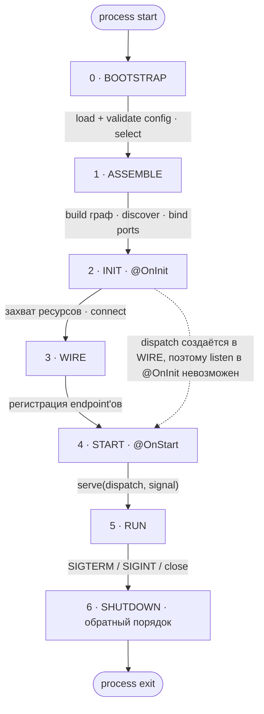

# Composition root и жизненный цикл

> **Целевое состояние V1.** Логика решений: [ideas.md](../decisions/ideas.md) —
> «Модульный монолит: фичи, `select`, дискавери из дерева модулей» [2026-07-08],
> «Жизненный цикл: фазы, `@OnStart`/go-live, гарантия `dispatch`» [2026-07-08],
> «Kernel/user space; конфиг как token-families» [2026-07-08],
> «Policy-check на собранном графе» [2026-07-14],
> «Пакет тестирования (`@nestling/testing`)» [2026-07-10] — `check()`.
> «Стиль документации: правила, глоссарий, перенос обоснований из `design/`» [2026-08-29],
> «Модель композиции: фича, плагин, операция» [2026-09-02],
> «Декларация приложения: `makeApp`, `assemble(select)`, `AssembledApp`» [2026-09-03].
> Статус реализации — [roadmap](../decisions/roadmap.md).

## 1. Жизненный цикл



### 0 · BOOTSTRAP

Контейнера ещё нет. Читаются источники конфига: env, файл, Vault. Это
единственное место, где читается `process.env`. Проверяется конфиг сборки и
конфиг провайдеров выбранных фич. Невалидный конфиг завершает процесс
(fail-fast); если источник временно недоступен, делается ограниченное число
повторов, потом процесс завершается. Результат фазы: `select`, значения
конфига и политика диспатча портов.

### 1 · ASSEMBLE

`select` определяет, какие фичи попадают в сборку. Discovery проходит по
выбранным фичам и подключённым плагинам и собирает endpoint'ы; глобального
реестра нет. Модули этих единиц регистрируются в контейнере. `build()` создаёт все провайдеры сразу, проверяет циклы и
вычисляет топологический порядок. Порты привязываются к реализациям: локальной
или удалённой через шину; если привязать не к чему, сборка падает. Формы io
деклараций сверяются с возможностями транспортов
([endpoints.md](./endpoints.md)). Последними проверяются объявленные
`policies:` на найденных endpoint'ах ([pipeline.md §7](./pipeline.md)). Все
проверки этой фазы идут до `@OnInit`: нарушение не успевает захватить ни
одного ресурса.

### 2 · INIT

`@OnInit` вызывается в топологическом порядке. Провайдеры захватывают ресурсы:
пул БД, соединение с NATS. Транспорты подключены, но запросы ещё не принимают.
`dispatch` ещё не существует.

### 3 · WIRE

Каждая декларация endpoint'а получает свои зависимости из контейнера: класс
хендлера и классы юнитов пайплайна (`endpoint.resolve(resolver)`). Затем для каждого транспорта собирается
таблица соответствия паттернов хендлерам — объект `dispatch`. На этой фазе
`dispatch` уже существует, но транспортам ещё не передан. Единственное
исключение — шина операций: она получает свой `dispatch` прямо здесь и
подписывается на subject'ы своих маршрутов ([operations.md](./operations.md)),
чтобы на следующей фазе порты уже можно было вызывать из `@OnStart`. Вызов
порта раньше WIRE завершается ошибкой с понятным сообщением.

### 4 · START

`@OnStart` вызывается в топологическом порядке, затем транспорты начинают
принимать запросы: каждый получает `serve(dispatch, signal)`. Метода
`listen()` без аргументов у транспорта нет. `dispatch` — один объект из двух
частей: `routes` (проекции маршрутов: паттерн и io-декларация, без `handler` и
`pipeline`) и `call` (исполнение). HTTP-транспорт открывает сокет, NATS
подписывается на subject'ы (реплики образуют queue-group).

### 5 · RUN

`port.call` и `emit` идут локально или через шину в зависимости от политики
диспатча. Reloadable-секции конфига обновляются (по opt-in).

### 6 · SHUTDOWN

Всё в обратном порядке: транспорты перестают принимать запросы (реверс START),
незавершённые запросы получают сигнал отмены (`meta.signal` у хендлеров и
подписок), затем `@OnDestroy` в обратном топологическом порядке закрывает пулы
и соединения.

### Инварианты

Инварианты, которые задаёт эта схема:

| Инвариант | Фаза |
|---|---|
| `process.env` читается только в конфиге | 0 |
| discovery проходит по фичам и плагинам, а не по глобальному реестру | 1 |
| ребро графа между двумя фичами — ошибка сборки | 1 |
| транспорты — узлы графа, объявленные корнем экземплярами | 1 |
| привязка портов вычисляется из графа, а не из внешнего конфига | 1 |
| `dispatch` создаётся на фазе 3, поэтому ранний `listen` невозможен (гарантия, не конвенция) | 2→3→4 |
| fail-fast: конфиг (0), привязка портов и отсутствующий транспорт (1) | 0, 1 |
| `select` — единственный вход, который читается до сборки | 0→1 |
| START в топологическом порядке, SHUTDOWN строго в обратном | 4 ↔ 6 |

Защита от `listen` в `@OnInit` держится на порядке фаз: `dispatch`
создаётся на WIRE, между INIT и START, и попадает к транспорту только
аргументом `serve`. Другого канала, по которому транспорт получал бы
декларации с хендлерами раньше, нет. Поэтому транспорт, который начал бы
принимать запросы до START, не смог бы их никуда направить. Почему WIRE не
объединён с ASSEMBLE — запись «Жизненный цикл» в журнале.

## 2. `makeApp` и `assemble`: composition root

Приложение объявляется одной функцией и собирается одним методом. Каждое
поле декларации опционально; механизм фич тоже опционален (прогрессивное
раскрытие — [principles.md](./principles.md)):

```typescript
// app.ts — декларация приложения: что оно есть. Файл экспортирует одно значение
export const app = makeApp({
  features?,    // L2: фичи приложения; подмножество выбирает select
  plugins?,     // сквозная инфраструктура; подключена всегда
  providers?,   // провайдеры корня, когда заводить единицу незачем
  config?,      // L1: привязка источников [[src, keys | glob]] (config.md)
  transports?,  // L0+: объявления экземпляров транспортов
  intercom?,    // L4: имя транспорта, переносящего операции
  policies?,    // инварианты на собранном графе; проверяются в конце
                //   фазы 1 ASSEMBLE — в run(), check() и assembleTest
                //   (pipeline.md §7)
});             // App: app.assemble(select?) · app.check(select?)

// main.ts — как приложение запускает этот процесс
await app.assemble(select).run();   // AssembledApp: run() · close()

// Политика диспатча вызывателей задаётся конфигом
// (NESTLING_PORTS_DISPATCH), а роль переносчика операций — полем intercom.
```

`makeApp` возвращает декларацию приложения — брендированное значение,
проверенное при создании, как `makeFeature`. Перечень полей закрыт.
Сквозная инфраструктура (логирование, трассировка, документация)
перечисляется в `plugins:` и подключена всегда; фичи перечисляются в
`features:` и выбираются. Привязка источников конфига — поле декларации:
источники входят в то, чем приложение является, а различия окружений
выражаются координатами самих источников ([config.md §3](./config.md)).
Подмена узлов графа (`overrides`) есть только у тестового корня
`assembleTest` ([testing.md](./testing.md)); `makeApp` о подменах не знает
и в контейнер их не передаёт.

Выбор фич — аргумент сборки, а не поле декларации: `select` меняет состав
процесса, а не приложения. `app.assemble(select?)` синхронна и ничего не
читает; она возвращает `AssembledApp`, фазы выполняет `run()`.

Декларация и собранное приложение предоставляют три метода:

| Метод | Где | Фазы | Что делает |
|---|---|---|---|
| `run()` | `AssembledApp` | 0–5 | доводит приложение до RUN и остаётся там; ставит обработчики сигналов |
| `check(select?)` | `App` | 0–1 | структурная проверка: граф строится, `@OnInit` не выполняется, ресурсы не захватываются; проверяет `policies:`; возвращает отчёт о составе (фичи, endpoint'ы по транспортам с причинами `detached`, транспорты, карта операций) и бросает те же ошибки, что бросил бы `run()` на этих фазах |
| `close()` | `AssembledApp` | 6 | SHUTDOWN в строгом обратном порядке; идемпотентен |

`check()` живёт на декларации, а не на собранном приложении: это «собрать
и выбросить», результат сборки ему не нужен. Он не сохраняет свой граф и
не влияет на последующий `assemble()` той же декларации. Поэтому им
проверяют матрицу `select`-топологий в CI ([testing.md §6](./testing.md)).

Уровни приложения:

| Уровень | Что добавляется | Чего ещё нет |
|---|---|---|
| L0 | одна фича и транспорт | `select`, конфиг-секций, операций, интеркома |
| L1 | типизированные конфиг-секции | `select`, операций, интеркома |
| L2 | несколько фич и `select` (`--features=all\|subset`) | операций, интеркома; все фичи в одном процессе |
| L3 | операции и их вызыватели; все фичи в одном процессе | интеркома; вызовы идут через in-process `dispatch` |
| L4 | `intercom:` на объявленный `nats()` | — это split-развёртывание |

**Код фич и endpoint'ов между L3 и L4 не меняется.** Разнесение по
процессам — это другой composition root и другой конфиг, а не другой
бизнес-код. Приложение уровня L0 не упоминает ни `select`, ни операции, ни
интерком: за неиспользуемые уровни не платят ни кодом, ни понятиями.

## 3. Прогрессия L0–L4

Сервисы объявляются классами, декларации — значениями
([endpoints.md](./endpoints.md), там же формы хендлера).

### L0 — фича и транспорт

```typescript
// orders.service.ts — сервис: класс, сам себе токен
@Injectable([])
export class OrdersService {
  create(dto: NewOrder): Order { /* ... */ }
}

// create-order.endpoint.ts — декларация: значение; поля HTTP типизированы
export const CreateOrder = httpEndpoint({
  method: 'POST',
  path: '/orders',
  input: NewOrder,
  output: Order,
  pipeline: basePipeline,
  handler: {
    deps: [OrdersService],
    handle: (orders) => async (input) => new Ok(orders.create(input)),
  },
});

// orders.feature.ts — фича: имя, состав и её endpoint'ы
export const OrdersFeature = makeFeature({
  name: 'orders',
  providers: [OrdersService],
  endpoints: [CreateOrder],
});

// app.ts — декларация приложения
export const app = makeApp({
  features: [OrdersFeature],
  transports: [http({ port: 3000 })],
});

// main.ts — запуск
await app.assemble().run();
```

### L1 — типизированный конфиг

Секция конфига — объект, в котором каждому полю сопоставлена схема. Она не знает, откуда придёт
значение: источники привязываются в корне. В коде приложения `process.env`
не читается. Полная модель конфига — [config.md](./config.md).

```typescript
// orders.config.ts — наружу из пакета экспортируется только OrdersConfig.keys
export const OrdersConfig = makeConfig('orders', {
  maxItems:    z.coerce.number().default(100),   // ключ ORDERS_MAX_ITEMS
  databaseUrl: from('DATABASE_URL', z.url()),     // общий ключ, без префикса
});

// orders.service.ts — секция инжектится как типизированный объект
@Injectable([OrdersConfig])
export class OrdersService {
  constructor(private cfg: Config<typeof OrdersConfig>) {}
  create(dto: NewOrder): Order {
    if (dto.items.length > this.cfg.maxItems) throw Fail.badRequest('too many');
    /* ... */
  }
}

// app.ts — единственный источник env: про конфиг в декларации ничего не пишут.
// Секции проверяются при сборке; невалидный конфиг роняет старт.
export const app = makeApp({
  features: [OrdersFeature],
  transports: [http({ port: 3000 })],
});
// Второй источник подключается так:
//   config: [[file('config.yaml'), [OrdersConfig.keys]]]
```

### L2 — фичи и `select`

```typescript
// features.ts — фича это значение: имя, состав и её endpoint'ы.
// Поля `dependsOn` у фичи нет: связь с соседями выводится из объявленных
// операций, а не дублируется списком имён.
export const OrdersFeature  = makeFeature({ name: 'orders',  modules: [OrdersModule] });
export const BillingFeature = makeFeature({ name: 'billing', modules: [BillingModule] });

// config.ts — select читается на фазе 0, до контейнера
export const RootConfig = makeConfig('app', {
  features: z.string().default('all'), // ключ APP_FEATURES: 'all' | 'orders,billing'
});

// app.ts — состав приложения не зависит от того, что выбрано в этом процессе
export const app = makeApp({
  features: [OrdersFeature, BillingFeature],
  plugins: [appLogging],         // инфраструктура подключена всегда
  transports: [http({ port: 3000 })],
});

// main.ts — load() читает select до сборки контейнера: синхронно и только
// из process.env; привязанные источники в этом чтении не участвуют.
const cfg = load(RootConfig);
await app.assemble(cfg.features).run();   // 'all' локально, 'orders' в отдельном поде
```

Невыбранная фича отсутствует целиком: её провайдеры не создаются (контейнер
жадный), её endpoint'ы не регистрируются (discovery видит только выбранные
единицы). Всё работает в одном процессе, интерком не нужен.

Формы `select`: `'all'`, `'orders,billing'` (пробелы вокруг имён
игнорируются), `['orders','billing']` и объектная
`{ features, includeDeps }`. Если `features` заданы, а `select` нет,
выбраны все фичи. Строковая форма остаётся, потому что выбор приходит из
переменной окружения — он строковый по природе.

`includeDeps: true` замыкает выбор по **вызываемым операциям**: фича,
реализующая вызываемую операцию вида `request` или `command`, подключается
сама, и фактический состав печатается на старте. События в замыкании не
участвуют: у события ноль или больше подписчиков, и отсутствие подписчика в
этом процессе — законная топология, а не недостача.

Вызовом считается упоминание `.caller` или `.emitter` и в `deps`
декларации, и в зависимостях провайдера: вызыватель — обычный токен.
Исключение одно — модуль, чьи `providers` заданы фабрикой: она вызывается
в `build()`, то есть после выбора, и её вызовы ловит уже проверка
достижимости на собранном графе.

Сборка падает на ASSEMBLE в четырёх случаях: имя неизвестно (ошибка
перечисляет доступные), две разные фичи носят одно имя, выбор пуст (`''`
или `[]`; «ничего» выражается отсутствием фич), `select` задан без
`features`.

### Граница фичи

К фиче обращаются **операциями**, к плагину — токенами. Правило следует из
одного критерия: токен не переживает границу процесса, а операция
переживает — у неё есть адрес и схемы, поэтому вызов работает одинаково
через `dispatch` и через интерком.

Отсюда три проверки на собранном графе:

| Ребро | Вердикт |
|---|---|
| провайдер фичи → провайдер другой фичи | ошибка: обращаться разрешено только операцией |
| провайдер фичи → провайдер плагина | разрешено: плагин есть в каждом процессе |
| провайдер плагина → провайдер фичи | ошибка: инфраструктура не зависит от бизнес-логики |

Модуль, достижимый из двух и более фич, обязан быть плагином: пока у него
два владельца, ребро в него нельзя классифицировать. Ошибка называет обе
фичи и предлагает перенести модуль в `plugins:`.

### L3 — операции и их вызыватели

Операции, вызыватели и правила их использования —
[operations.md](./operations.md).

```typescript
// billing/operations.ts — операцией владеет billing, потребители её импортируют
export const ChargeCard = makeRequest({   // запрос-ответ, может вернуть Fail
  name: 'billing.charge',
  input:  z.object({ orderId: z.string(), amount: z.number() }),
  output: z.object({ chargeId: z.string() }),
});

// billing реализует операцию; привязка вычисляется при сборке
export const ChargeCardHandler = implement(ChargeCard, {
  handler: {
    deps: [PaymentGateway],
    handle: (gw) => async (input, meta) =>
      new Ok({ chargeId: await gw.charge(input, meta.signal) }),
  },
});

// orders вызывает порт: обычная зависимость декларации
export const CreateOrder = httpEndpoint({
  method: 'POST',
  path: '/orders',
  input: NewOrder,
  output: Order,
  pipeline: basePipeline,
  handler: {
    deps: [OrdersService, ChargeCard.caller],
    handle: (orders, billing) => async (input, meta) => {
      const charge = await billing.call({ orderId: input.id, amount: input.total }, meta);
      if (charge.isFail) return charge;    // отказ соседа — обычный Fail, не исключение
      return new Ok(orders.create(input));
    },
  },
});

// main.ts не изменился с L2: привязка вызывателя вычисляется из графа.
// billing выбран, поэтому ChargeCard.caller привязан к местной реализации.
```

### L4 — интерком и split-развёртывание

```typescript
// app.ts — меняется только декларация и конфиг; endpoint'ы те же
export const app = makeApp({
  features: [OrdersFeature, BillingFeature],
  transports: [
    http(),
    nats({ name: 'events' }),            // объявление экземпляра транспорта
  ],                                     // порт HTTP и адреса NATS — из секций Http/NatsConfig
  intercom: 'events',                    // роль переносчика операций
});

// main.ts
const cfg = load(RootConfig);            // до сборки читается только select
await app.assemble(cfg.features).run();  // 'orders' здесь, 'billing' в другом поде

// Политика диспатча задаётся конфигом, а не полем корня.
// NESTLING_PORTS_DISPATCH=local-first (по умолчанию): реализации из этого
// процесса вызываются напрямую, остальные — через интерком.
```

`intercom:` **назначает роль ссылкой** на уже объявленный транспорт, а не
объявляет второй. Годятся только транспорты, переносящие операции; HTTP в
эту роль не встаёт, и это проверяет компилятор. Объявленная шина без
назначенной роли — ошибка сборки: соединение занято, а переносить нечего.

При `select='orders'` фича billing в этом процессе не выбрана, и
`ChargeCard.caller` привязывается к удалённому вызывателю поверх NATS:
невыбранный владелец операции означает, что он работает в другом поде.
Billing в своём поде обслуживает `billing.charge`; его реплики образуют
queue-group. Тот же корень с `select='all'` поднимает обе фичи в одном
процессе: `request` и `command` вызываются напрямую через `dispatch`, а
`event` всё равно уходит через интерком, потому что подписчики события
могут быть и в других подах, и терять их молча нельзя. Без `intercom:`
приложение работает на in-process шине без правок деклараций и вызовов.
Один бинарник обслуживает разные топологии за счёт `select` и конфига.

Обе топологии на одном коде — `examples/split-nats`: один корень,
одни декларации, разный `select`.

## 4. Транспорты

Транспорт — обычный узел графа: синглтон с зависимостями и жизненным
циклом. Корень перечисляет **объявления экземпляров**: `http()`,
`http({ name: 'admin', port: 3001 })`, `nats({ name: 'events' })`. Каждый
экземпляр получает своё имя, и декларация выбирает свой через `on:`; без
`on:` это `'default'`. Ограничения «один HTTP на сборку» больше нет.

Декларация ссылается на транспорт токеном; если экземпляра нет в графе,
сборка падает на ASSEMBLE. Порт и адреса транспорт читает из своей
конфиг-секции (`HTTP_PORT`, `NATS_SERVERS`), а не из литералов в корне.
Интерфейс транспорта и байтовый уровень (сжатие, CORS, парсинг) —
[transports.md](./transports.md).

## 5. Плагин: сквозная инфраструктура

Сквозная инфраструктура — логирование, трассировка, документация, клиент
внешнего сервиса — объявляется **плагином**: `makePlugin` и поле корня
`plugins:`. Роль даёт ровно две вещи: своё место в корне и правило «к
плагину обращаются токенами». Новых механизмов она не приносит — ни хука
конфигурации, ни ambient middleware, ни реестра поднятой инфраструктуры:

| Часть плагина | Механизм Nestling |
|---|---|
| подключение в корне | `plugins:` — единица есть в каждом процессе и в словарь `select` не входит |
| параметры плагина | функция, возвращающая значение: `logging({ … })`; значение создаётся один раз и импортируется ([container.md](./container.md)) |
| конфиг плагина | секция `makeConfig`, объявленная самим плагином; наружу экспортируется только `.keys` ([config.md](./config.md)) |
| зависимость от другого плагина | `dependsOn:` со ссылками **только на плагины**; параметризованная зависимость выражается токеном |
| «только для этих транспортов» | обычная зависимость от токена транспорта; отсутствие экземпляра роняет сборку на ASSEMBLE |
| «плагин, знающий состав приложения» | зависимость от `Discovery$`: состав приложения как обычный узел графа (ниже) |
| middleware на все endpoint'ы | экспортируемый слой пайплайна плюс политика `everyEndpoint(…).hasLayer(ref)` ([pipeline.md §7](./pipeline.md)) |
| форматирование и отправка ошибок | `.catch`- и `.finally`-юниты того же слоя ([errors.md](./errors.md)) |
| обогащение контекста | `.pre`-юнит слоя; чтение из глубины — ридеры асинхронного контекста |

Имя плагина совпадает с именем npm-пакета, который его поставляет: иначе
два чужих пакета роняют сборку коллизией имён, и починить её нечем — оба
имени заданы их авторами. Endpoint'ы у плагина законны:
`@nestling/openapi` — инфраструктура и объявляет служебный endpoint с
документом.

### Состав приложения как узел графа

Сборка регистрирует результат discovery провайдером-значением под
токеном `Discovery$` — всегда, без условий. Это то же значение, которое
`App` вычислил до построения графа; второй проход не выполняется.
Через `Discovery$` плагин видит выбранную топологию, не дублируя `select`
в корне. Значение read-only: списки заморожены, мутаторы карты бросают
исключение. Инжектируемый discovery — поверхность для интроспекции, а не
точка расширения: состав приложения определяется списками `features:` и
`plugins:` и полем `select`, а не графом. Первый потребитель — генерация документации
([schemas.md §2.1](./schemas.md)).

### Параметр плагина и конфиг-секция

Параметр функции-плагина — решение composition root: какие провайдеры
существуют, какая реализация выбрана, как назван инстанс. Оно известно при
сборке и видно в диффе ревью. Конфиг-секция, которую модуль объявляет сам,
— решение среды: адреса, порты, уровни логирования, таймауты. Её значения
приходят из источников, проверяются на `build()` и могут быть reloadable.
Критерий для автора плагина: то, что меняется без пересборки образа, —
секция; то, что меняет набор провайдеров, — параметр.

### Почему плагин подключён всегда

Плагин доступен всем токенами, а токен не переживает границу процесса.
Значит, единица, к которой обращаются токеном, обязана быть в каждом
процессе — иначе сборка ломалась бы при первом же разъезде. Отсюда и место
в корне: `plugins:` не участвует в `select`.

Фичи в одном процессе получают один инстанс каждого плагина; фичи в разных
процессах — по инстансу на процесс. Специального кода для этого не нужно:
так работают жадный контейнер и `select`. «Есть в процессе» означает только,
что провайдер есть в графе; инжектировать его может лишь тот, кто
импортировал токен.

Плагин не зависит от фичи, и это правило симметрично основному. Данные
приложения он получает двумя обычными путями: параметром при объявлении
(`logging({ service: 'orders-api' })`) либо через токен, объявленный самим
плагином и реализованный кем угодно.

### Сквозное поведение: слой плюс политика

Инфра-модуль экспортирует слой пайплайна значением, endpoint'ы композируют
его явно, а политика на собранном графе гарантирует, что слой есть везде:

```typescript
// infrastructure.ts — значение создаётся один раз и перечисляется в корне
export const appLogging = logging({ service: 'orders-api' });

// app.ts
export const app = makeApp({
  features: [OrdersFeature, OpsFeature],
  plugins: [appLogging],
  transports: [http()],
  policies: [
    everyEndpoint({ transport: HttpTransport$('default') }).hasLayer(
      observability,
    ),
  ],
});
```

Уровней пайплайна для всего приложения или для единицы нет
([pipeline.md](./pipeline.md)): слой всегда виден в декларации endpoint'а.
Забытый слой обнаруживается на ASSEMBLE с именем endpoint'а. Осознанное
исключение записывается причиной (`detached: '<почему>'`), которую видно в
диффе и в отчёте `check()`.
