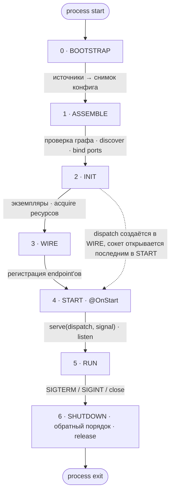

# Composition root и жизненный цикл

> **Целевое состояние V1.** Логика решений: [ideas.md](../decisions/ideas.md) —
> «Модульный монолит: фичи, `select`, дискавери из дерева модулей» [2026-07-08],
> «Жизненный цикл: фазы, `@OnStart`/go-live, гарантия `dispatch`» [2026-07-08],
> «Kernel/user space; конфиг как token-families» [2026-07-08],
> «Policy-check на собранном графе» [2026-07-14],
> «Пакет тестирования (`@nestling/testing`)» [2026-07-10] — `check()`.
> «Стиль документации: правила, глоссарий, перенос обоснований из `design/`» [2026-08-29],
> «Модель композиции: фича, плагин, операция» [2026-09-02],
> «Декларация приложения: `makeApp`, `assemble(select)`, `AssembledApp`» [2026-09-03],
> «Фаза 0 BOOTSTRAP: источники до сборки, синхронный `build()`, фабрики без I/O» [2026-09-06],
> «Ресурсы и роли классов: `@Component`, `@Resource`, `@Handler`; экземпляры на INIT» [2026-09-06],
> «Переключатели состава: `makeSwitch`, `pick` и `when`, аргумент сборки; формы корня без фич» [2026-09-06],
> «Пробы: `HealthCheck$` и `Health$` в ядре, транспорты адаптируют» [2026-09-06],
> «Логгер ядра: `RootLogger$`, семейство `Logger$` с `.auto` и `child`» [2026-09-06],
> «HTTP-сервер как ресурс: `httpServer({ name })`, `http({ server })`» [2026-09-06].
> Статус реализации — [roadmap](../decisions/roadmap.md).

## 1. Жизненный цикл



### 0 · BOOTSTRAP

Контейнера ещё нет. Поднимаются привязанные источники конфига: env, файл,
Vault. Читалка создаётся вне контейнера, `init()` каждого источника
вызывается один раз, в порядке привязок. Это единственное место, где
читается `process.env`. Значения объявленных ключей складываются в снимок:
обычный объект без обращений к сети. Результат фазы — снимок конфига.

Отказ источника останавливает старт ошибкой, называющей источник по имени;
исходная ошибка лежит в `cause`. Повторы объявляет сам источник — параметром
своей фабрики (`vault({ retries: 3 })`): цену и уместность повтора знает он,
ядру нечем отличить временный отказ от постоянного.

Читалка живёт время `run()`: она входит в граф провайдером-значением, а
закрывается явным шагом фазы SHUTDOWN, после разрушения контейнера.

Аргумент сборки (выбор фич и значения переключателей, §3) в эту фазу не
входит: его читает пользовательский код до вызова `assemble`, синхронно и
только из `process.env` через `load(RootConfig)`.

### 1 · ASSEMBLE

Фаза синхронна и не выполняет ввод-вывод. Аргумент сборки определяет,
какие фичи попадают в сборку и какие ветки переключателей выбраны.
Discovery проходит по выбранным фичам и подключённым плагинам и собирает
endpoint'ы; глобального реестра нет. Модули этих единиц регистрируются в
контейнере. Секции конфига считаются из снимка и валидируются;
невалидное значение останавливает старт. `build()` проверяет граф: циклы,
отсутствующие DI-токены, роли классов в позициях, границу фич. Экземпляров
на этой фазе нет. Порты привязываются к реализациям: локальной или
удалённой через шину; если привязать не к чему, сборка падает. Формы io
деклараций сверяются со способностями транспортов, объявленными на их
декларациях ([transports.md](./transports.md)). Дубликат паттерна в одном
экземпляре транспорта останавливает сборку с именами обеих единиц.
Последними проверяются объявленные `policies:` на найденных endpoint'ах
([pipeline.md §7](./pipeline.md)). Все проверки этой фазы идут до INIT:
нарушение не успевает захватить ни одного ресурса.

### 2 · INIT

Граф проходится в топологическом порядке, и на каждом узле создаётся
экземпляр. Компонент конструируется через `new`. Ресурс захватывается:
`await acquire(...deps, signal)` открывает пул БД или соединение с NATS и
возвращает готовое значение ([container.md](./container.md)). Потребитель
ресурса создаётся после него и получает в конструктор захваченное
значение, поэтому проверок «инициализировано ли» в коде приложения нет.
Провал захвата освобождает уже захваченное в обратном порядке и роняет
старт. Сигнал захвата взводится по `SIGTERM` во время старта. Транспорты
существуют, но запросы ещё не принимают. `dispatch` ещё не существует.

### 3 · WIRE

Каждая декларация endpoint'а получает свои зависимости из контейнера: класс
хендлера и классы юнитов пайплайна (`endpoint.resolve(resolver)`). Затем для каждого транспорта собирается
таблица соответствия паттернов хендлерам — объект `dispatch`. На этой фазе
`dispatch` уже существует, но транспортам ещё не передан. Единственное
исключение — шина операций: она получает свой `dispatch` прямо здесь и
подписывается на subject'ы своих маршрутов ([operations.md](./operations.md)),
чтобы на следующей фазе порты уже можно было вызывать из `@OnStart`. Вызов
порта раньше WIRE завершается ошибкой с понятным сообщением.

### 4 · START

`@OnStart(signal)` вызывается в топологическом порядке. Затем транспорты
получают `serve(dispatch, signal)`: HTTP-транспорт присоединяет
обработчик к своему серверу, NATS подписывается на subject'ы (реплики
образуют queue-group). Последними открывают сокет серверы (`listen`,
[transports.md §4](./transports.md)). Метода `listen()` без аргументов у
транспорта нет. `dispatch` — один объект из двух частей: `routes`
(проекции маршрутов: паттерн и io-декларация, без `handler` и `pipeline`)
и `call` (исполнение).

### 5 · RUN

`port.call` и `emit` идут локально или через шину в зависимости от политики
диспатча. Reloadable-секции конфига обновляются (по opt-in). Readiness
приложения истинна только в этой фазе (§6).

### 6 · SHUTDOWN

Всё в обратном порядке: серверы перестают принимать соединения и
дренажат открытые, транспорты закрываются (реверс START), незавершённые
запросы получают сигнал отмены (`meta.signal` у хендлеров и подписок),
сигнал `@OnStart` взводится, затем `release` ресурсов в обратном
топологическом порядке закрывает пулы и соединения. Последними — уже после
разрушения контейнера — закрываются источники конфига: читалка узлом графа
не управляется, её время жизни есть время `run()`.

### Инварианты

Инварианты, которые задаёт эта схема:

| Инвариант | Фаза |
|---|---|
| `process.env` читается только в конфиге | 0 |
| источники конфига поднимаются до контейнера, повторы объявляет источник | 0 |
| `build()` синхронен и не выполняет ввод-вывод | 1 |
| фабрика провайдера синхронна: `Promise` из неё — ошибка сборки | 1 |
| discovery проходит по фичам и плагинам, а не по глобальному реестру | 1 |
| ребро графа между двумя фичами — ошибка сборки | 1 |
| транспорты — узлы графа, объявленные корнем экземплярами | 1 |
| привязка портов вычисляется из графа, а не из внешнего конфига | 1 |
| дубликат паттерна в экземпляре транспорта — ошибка сборки | 1 |
| потребитель ресурса создаётся после захвата ресурса | 2 |
| `dispatch` создаётся на фазе 3, сокет открывается последним на фазе 4 (гарантия, не конвенция) | 2→3→4 |
| fail-fast: источники (0), конфиг, привязка портов и отсутствующий транспорт (1), захват ресурсов (2) | 0, 1, 2 |
| аргумент сборки — единственный вход, который читается до контейнера | 0→1 |
| START в топологическом порядке, SHUTDOWN строго в обратном | 4 ↔ 6 |

Защита от раннего приёма запросов держится на порядке фаз: `dispatch`
создаётся на WIRE, между INIT и START, попадает к транспорту только
аргументом `serve`, а сокет открывается после `serve` всех транспортов.
Другого канала, по которому транспорт получал бы декларации с хендлерами
раньше, нет. Поэтому транспорт, который начал бы принимать запросы до
START, не смог бы их никуда направить. Почему WIRE не объединён с
ASSEMBLE — запись «Жизненный цикл» в журнале.

## 2. `makeApp` и `assemble`: composition root

Приложение объявляется одной функцией и собирается одним методом. Каждое
поле декларации опционально; механизм фич тоже опционален (прогрессивное
раскрытие — [principles.md](./principles.md)):

```typescript
// app.ts — декларация приложения: что оно есть. Файл экспортирует одно значение
export const app = makeApp({
  endpoints?,   // L0: endpoint'ы корня; вместе с providers или modules, без features
  providers?,   // провайдеры корня (только вместе с endpoints)
  modules?,     // модули корня (только вместе с endpoints)
  features?,    // L2: фичи приложения; подмножество выбирает аргумент сборки
  plugins?,     // сквозная инфраструктура; подключена всегда
  switches?,    // L2: словарь переключателей состава (§3)
  config?,      // L1: привязка источников [[src, keys | glob]] (config.md)
  transports?,  // L0+: объявления экземпляров транспортов и серверов
  intercom?,    // L4: имя транспорта, переносящего операции
  logger?,      // корневой логгер приложения; готовое значение Logger
  policies?,    // инварианты на собранном графе; проверяются в конце
                //   фазы 1 ASSEMBLE — в run(), check() и assembleTest
                //   (pipeline.md §7)
});             // App: app.assemble(args?) · app.check(args?, options?)

// main.ts — как приложение запускает этот процесс
await app.assemble(args).run();     // AssembledApp: run() · close()

// Политика диспатча вызывателей задаётся конфигом
// (NESTLING_PORTS_DISPATCH), а роль переносчика операций — полем intercom.
```

`makeApp` возвращает декларацию приложения — брендированное значение,
проверенное при создании, как `makeFeature`. Перечень полей закрыт.
Состав описывается одной из трёх форм, и это проверяет тип:
`{ endpoints, providers? }`, `{ endpoints, modules? }` или `{ features }`.
Первые две формы — состав одной фичи без имени; их endpoint'ы
атрибутируются внутренней единице с именем `app`, а провайдеры корня
получают метку модуля `app`. Сквозная инфраструктура
(логирование, трассировка, документация) перечисляется в `plugins:` и
подключена всегда; фичи перечисляются в `features:` и выбираются.
Привязка источников конфига — поле декларации: источники входят в то, чем
приложение является, а различия окружений выражаются координатами самих
источников ([config.md §3](./config.md)). Поле `logger:` задаёт корневой
логгер — это единственный способ заменить `ConsoleLogger` ядра. Значение
готовое: корень существует раньше графа и зависеть от его узлов не может,
зато записи всех фаз, включая предупреждения сборки, уходят в него
([container.md](./container.md), «Логгер»). Подмена узлов графа
(`overrides`) есть только у тестового корня `assembleTest`
([testing.md](./testing.md)); `makeApp` о подменах не знает и в контейнер
их не передаёт.

Аргумент сборки (выбор фич и значения переключателей) принадлежит
сборке, а не декларации: он меняет состав процесса, а не приложения.
`app.assemble(args?)` синхронна и ничего не читает; она возвращает
`AssembledApp`, фазы выполняет `run()`. Тип аргумента выводится из
декларации: `{ features?, ...значения переключателей из switches: }`;
строковая форма `assemble('all')` задаёт только выбор фич.

Декларация и собранное приложение предоставляют три метода:

| Метод | Где | Фазы | Что делает |
|---|---|---|---|
| `run()` | `AssembledApp` | 0–5 | доводит приложение до RUN и остаётся там; ставит обработчики сигналов |
| `check(args?, options?)` | `App` | 0–1 | структурная проверка: граф проверяется, экземпляры не создаются, ресурсы не захватываются; проверяет `policies:`; возвращает отчёт о составе (фичи, переключатели, endpoint'ы по транспортам с причинами `detached`, транспорты, карта операций) и бросает те же ошибки, что бросил бы `run()` на этих фазах. `options.config` заменяет источники декларации, как в `assembleTest` |
| `close()` | `AssembledApp` | 6 | SHUTDOWN в строгом обратном порядке; идемпотентен |

`check()` живёт на декларации, а не на собранном приложении: это «собрать
и выбросить», результат сборки ему не нужен. Он не сохраняет свой граф и
не влияет на последующий `assemble()` той же декларации. Поэтому им
проверяют матрицу топологий в CI ([testing.md §6](./testing.md)).

Уровни приложения:

| Уровень | Что добавляется | Чего ещё нет |
|---|---|---|
| L0 | endpoint'ы, провайдеры и транспорт в корне | фич, выбора, конфиг-секций, операций, интеркома |
| L1 | типизированные конфиг-секции | фич, выбора, операций, интеркома |
| L2 | фичи, выбор и переключатели состава | операций, интеркома; все фичи в одном процессе |
| L3 | операции и их вызыватели; все фичи в одном процессе | интеркома; вызовы идут через in-process `dispatch` |
| L4 | `intercom:` на объявленный `nats()` | — это split-развёртывание |

**Код endpoint'ов и провайдеров между уровнями не меняется.** Переход с
L0 на L2 переписывает только `app.ts`: endpoint'ы и провайдеры корня
переезжают в фичи. Разнесение по процессам на L4 — это другой composition
root и другой конфиг, а не другой бизнес-код. Приложение уровня L0 не
упоминает ни фич, ни выбора, ни операций, ни интеркома: за
неиспользуемые уровни не платят ни кодом, ни понятиями.

## 3. Прогрессия L0–L4

Сервисы объявляются классами с ролью ([container.md](./container.md)),
декларации — значениями ([endpoints.md](./endpoints.md), там же формы
хендлера).

### L0 — endpoint'ы и транспорт

```typescript
// orders.service.ts — компонент: класс, сам себе DI-токен
@Component()
export class OrdersService {
  create(dto: NewOrder): Order { /* ... */ }
}

// create-order.endpoint.ts — хендлер и декларация
@Handler([OrdersService])
export class CreateOrderHandler {
  constructor(private orders: OrdersService) {}
  async handle(input: NewOrder): Output<Order> {
    return this.orders.create(input);
  }
}

export const CreateOrder = httpEndpoint({
  method: 'POST',
  path: '/orders',
  input: NewOrder,
  output: Order,
  handler: CreateOrderHandler,
});

// app.ts — декларация приложения: состав одной фичи без имени
export const app = makeApp({
  endpoints: [CreateOrder],
  providers: [OrdersService],
  transports: [http()],          // порт и хост — из секции HTTP_PORT, HTTP_HOST
});

// main.ts — запуск
await app.assemble().run();
```

### L1 — типизированный конфиг

Секция конфига — объект, в котором каждому полю сопоставлена схема. Она не знает, откуда придёт
значение: источники привязываются в корне. В коде приложения `process.env`
не читается. Полная модель конфига — [config.md](./config.md).

```typescript
// orders.config.ts — наружу из пакета экспортируется только OrdersConfig.keys
export const OrdersConfig = makeConfig('orders', {
  maxItems:    z.coerce.number().default(100),   // ключ ORDERS_MAX_ITEMS
  databaseUrl: from('DATABASE_URL', z.url()),     // общий ключ, без префикса
});

// orders.errors.ts — объявленный отказ (errors.md)
export const OrderLimitReached = makeFail('bad_request:order_limit', {
  details: z.object({ max: z.number() }),
});

// orders.service.ts — секция инжектится как типизированный объект
@Component([OrdersConfig])
export class OrdersService {
  constructor(private cfg: Config<typeof OrdersConfig>) {}
  create(dto: NewOrder): Order | Fail {
    if (dto.items.length > this.cfg.maxItems) return OrderLimitReached({ max: this.cfg.maxItems });
    /* ... */
  }
}

// app.ts — единственный источник env: про конфиг в декларации ничего не пишут.
// Секции проверяются при сборке; невалидный конфиг роняет старт.
export const app = makeApp({
  endpoints: [CreateOrder],
  providers: [OrdersService],
  transports: [http()],
});
// Второй источник подключается так:
//   config: [[file('config.yaml'), [OrdersConfig.keys]]]
```

### L2 — фичи, выбор и переключатели

```typescript
// features.ts — фича это значение: имя, состав и её endpoint'ы.
// Поля `dependsOn` у фичи нет: связь с соседями выводится из объявленных
// операций, а не дублируется списком имён.
export const OrdersFeature  = makeFeature({ name: 'orders',  modules: [OrdersModule] });
export const BillingFeature = makeFeature({ name: 'billing', modules: [BillingModule] });

// config.ts — аргумент сборки читается до контейнера
export const RootConfig = makeConfig('app', {
  features: z.string().default('all'), // ключ APP_FEATURES: 'all' | 'orders,billing'
});

// app.ts — состав приложения не зависит от того, что выбрано в этом процессе
export const app = makeApp({
  features: [OrdersFeature, BillingFeature],
  plugins: [appLogging],         // инфраструктура подключена всегда
  transports: [http()],
});

// main.ts — load() читает аргумент сборки до контейнера: синхронно и только
// из process.env; привязанные источники в этом чтении не участвуют.
const cfg = load(RootConfig);
await app.assemble(cfg.features).run();   // 'all' локально, 'orders' в отдельном поде
```

Невыбранная фича отсутствует целиком: её провайдеры не создаются, её
endpoint'ы не регистрируются (discovery видит только выбранные единицы).
Всё работает в одном процессе, интерком не нужен.

Формы выбора фич: `'all'`, `'orders,billing'` (пробелы вокруг имён
игнорируются), `['orders','billing']` и объектная
`{ features, includeDeps }`. Если `features` заданы, а выбор нет,
выбраны все фичи. Строковая форма остаётся, потому что выбор приходит из
переменной окружения — он строковый по природе.

`includeDeps: true` замыкает выбор по **вызываемым операциям**: фича,
реализующая вызываемую операцию вида `request` или `command`, подключается
сама, и фактический состав печатается на старте. События в замыкании не
участвуют: у события ноль или больше подписчиков, и отсутствие подписчика в
этом процессе — законная топология, а не недостача.

Вызовом считается упоминание `.caller` или `.emitter` и в `deps`
декларации, и в зависимостях провайдера: вызыватель — обычный DI-токен.
Ветки переключателей разрешаются до замыкания, поэтому замыкание видит
уже выбранный состав.

Сборка падает на ASSEMBLE в четырёх случаях: имя неизвестно (ошибка
перечисляет доступные), две разные фичи носят одно имя, выбор пуст (`''`
или `[]`; «ничего» выражается отсутствием фич), выбор задан без
`features`.

### Переключатели состава

Переключатель — значение, которое выбирает одну из объявленных веток
состава по значению, известному до сборки. Его импортируют и модуль, и
корень, как секцию конфига.

```typescript
// switches.ts
export const Storage = makeSwitch('storage', ['s3', 'local']);   // перечисление
export const Metrics = makeSwitch('metrics');                     // 'on' | 'off'
export const Debug   = makeSwitch('debug', { default: 'off' });

// storage.module.ts — обе ветки перечислены таблицей
export const StorageModule = makeModule({
  name: 'module:storage',
  providers: [
    UploadsService,
    Storage.pick({ s3: [S3Client, S3Storage], local: [LocalStorage] }),
    Metrics.when(StorageMetrics),          // то же, что pick({ on: StorageMetrics, off: [] })
  ],
});

// uploads.feature.ts
export const UploadsFeature = makeFeature({
  name: 'uploads',
  modules: [StorageModule],
  endpoints: [UploadFile, Debug.when([DumpUploads, ResetUploads])],
});

// app.ts — словарь переключателей объявлен рядом с фичами
export const app = makeApp({
  features: [UsersFeature, UploadsFeature],
  plugins: [appLogging, Metrics.when(appMetrics)],
  transports: [http(), Debug.when(http({ name: 'admin' }))],
  switches: [Storage, Metrics, Debug],
});

// config.ts — у переключателя есть схема его значений с умолчанием
export const RootConfig = makeConfig('app', {
  features: z.string().default('all'),   // APP_FEATURES
  storage: Storage.schema,               // APP_STORAGE: 's3' | 'local', обязательна
  metrics: Metrics.schema,               // APP_METRICS: 'on' | 'off', обязательна
  debug: Debug.schema,                   // APP_DEBUG, по умолчанию 'off'
});

// main.ts — поля названы как переключатели, поэтому cfg подходит целиком
await app.assemble(load(RootConfig)).run();
```

- У перечисления единственный метод `pick(table)`. Таблица перечисляет
  все значения; неполная таблица не компилируется. У двухпозиционного
  переключателя есть `pick({ on, off })` и `when(x)`. Ветка — одно
  значение, массив или пустой массив.
- Переключатель стоит в любом списке единиц: `providers:`, `modules:`
  фичи, `dependsOn:` модуля, `endpoints:`, `plugins:` и `transports:`
  корня. В `features:` его нет: состав фич выбирает аргумент сборки. В
  `policies:` его нет: инвариант либо есть, либо его нет.
- `switches:` корня объявляет словарь. Из него выводится тип аргумента
  `assemble`; `.schema` переключателя описывает поле `RootConfig`, и
  `load(RootConfig)` подходит аргументом целиком, если имена полей
  совпадают с именами переключателей.
- Сборка падает на ASSEMBLE, если значение не из словаря (ошибка
  перечисляет допустимые), если `pick` стоит на переключателе, которого
  нет в `switches:`, если два переключателя носят одно имя, если значение
  без умолчания не передано.
- DI-токена у переключателя нет: инжектировать выбор нельзя, состав не
  протекает в код приложения. `check()` получает измерение на каждый
  переключатель, строка старта печатает выбор рядом с фичами:
  `[nestling] features: users, uploads; storage=s3 metrics=on debug=off;`
  `transports: http`.

### Граница фичи

К фиче обращаются **операциями**, к плагину — DI-токенами. Правило следует из
одного критерия: DI-токен не переживает границу процесса, а операция
переживает — у неё есть адрес и схемы, поэтому вызов работает одинаково
через `dispatch` и через интерком.

Отсюда три проверки на собранном графе:

| Ребро | Вердикт |
|---|---|
| провайдер фичи → провайдер другой фичи | ошибка: обращаться разрешено только операцией |
| провайдер фичи → провайдер плагина | разрешено: плагин есть в каждом процессе |
| провайдер плагина → провайдер фичи | ошибка: инфраструктура не зависит от бизнес-логики |

Модуль, достижимый из двух и более фич, обязан быть плагином: пока у него
два владельца, ребро в него нельзя классифицировать. Ошибка называет обе
фичи и предлагает перенести модуль в `plugins:`.

### L3 — операции и их вызыватели

Операции, вызыватели и правила их использования —
[operations.md](./operations.md).

```typescript
// billing/operations.ts — операцией владеет billing, потребители её импортируют
export const ChargeCard = makeRequest({   // запрос-ответ, может вернуть Fail
  name: 'billing.charge',
  input:  z.object({ orderId: z.string(), amount: z.number() }),
  output: z.object({ chargeId: z.string() }),
});

// billing реализует операцию; привязка вычисляется при сборке
@Handler([PaymentGateway])
class ChargeCardHandler implements Handler<typeof ChargeCard> {
  constructor(private gw: PaymentGateway) {}
  async handle(input: ChargeCardInput, meta: HandlerMeta) {
    return { chargeId: await this.gw.charge(input, meta.signal) };
  }
}
export const ChargeCardImpl = implement(ChargeCard, { handler: ChargeCardHandler });

// orders вызывает порт: обычная зависимость хендлера
@Handler([OrdersService, ChargeCard.caller])
class CreateOrderHandler {
  constructor(
    private orders: OrdersService,
    private billing: Port<typeof ChargeCard>,
  ) {}
  async handle(input: NewOrder, meta: HandlerMeta): Output<Order, typeof CardDeclined> {
    const charge = await this.billing.call({ orderId: input.id, amount: input.total }, meta);
    if (charge.isFail) return charge;    // отказ соседа — обычный Fail, не исключение
    return this.orders.create(input);
  }
}

// main.ts не изменился с L2: привязка вызывателя вычисляется из графа.
// billing выбран, поэтому ChargeCard.caller привязан к местной реализации.
```

### L4 — интерком и split-развёртывание

```typescript
// app.ts — меняется только декларация и конфиг; endpoint'ы те же
export const app = makeApp({
  features: [OrdersFeature, BillingFeature],
  transports: [
    http(),
    nats({ name: 'events' }),            // объявление экземпляра транспорта
  ],                                     // порт HTTP и адреса NATS — из секций Http/NatsConfig
  intercom: 'events',                    // роль переносчика операций
});

// main.ts
const cfg = load(RootConfig);            // до сборки читается только аргумент сборки
await app.assemble(cfg.features).run();  // 'orders' здесь, 'billing' в другом поде

// Политика диспатча задаётся конфигом, а не полем корня.
// NESTLING_PORTS_DISPATCH=local-first (по умолчанию): реализации из этого
// процесса вызываются напрямую, остальные — через интерком.
```

`intercom:` **назначает роль ссылкой** на уже объявленный транспорт, а не
объявляет второй. Годятся только транспорты, переносящие операции; HTTP в
эту роль не встаёт, и это проверяет компилятор. Объявленная шина без
назначенной роли — ошибка сборки: соединение занято, а переносить нечего.

При `assemble('orders')` фича billing в этом процессе не выбрана, и
`ChargeCard.caller` привязывается к удалённому вызывателю поверх NATS:
невыбранный владелец операции означает, что он работает в другом поде.
Billing в своём поде обслуживает `billing.charge`; его реплики образуют
queue-group. Тот же корень с `assemble('all')` поднимает обе фичи в одном
процессе: `request` и `command` вызываются напрямую через `dispatch`, а
`event` всё равно уходит через интерком, потому что подписчики события
могут быть и в других подах, и терять их молча нельзя. Без `intercom:`
приложение работает на in-process шине без правок деклараций и вызовов.
Один бинарник обслуживает разные топологии за счёт аргумента сборки и конфига.

Обе топологии на одном коде — `examples/split-nats`: один корень,
одни декларации, разный аргумент сборки.

## 4. Транспорты и серверы

Транспорт — обычный узел графа: синглтон с зависимостями и жизненным
циклом. Корень перечисляет **объявления экземпляров**: `http()`,
`http({ name: 'admin' })`, `nats({ name: 'events' })`. Каждый экземпляр
получает своё имя, и декларация выбирает свой через `on:`; без `on:` это
`'default'`. Ограничения «один HTTP на сборку» нет.

Сервер — ресурс, который держит сокет. HTTP-транспорт присоединяется к
серверу; без явного сервера он объявляет собственный с тем же именем.
Несколько транспортов на одном сокете получают один сервер:

```typescript
transports: [http()],                                  // сервер по умолчанию: HTTP_PORT, HTTP_HOST

const api = httpServer({ name: 'api' });               // HTTP_API_PORT, HTTP_API_HOST
transports: [http({ server: api }), graphql({ server: api })],
```

Декларация ссылается на транспорт DI-токеном; если экземпляра нет в графе,
сборка падает на ASSEMBLE. Порт и адреса сервер и транспорт читают из
своих конфиг-секций (`HTTP_PORT`, `NATS_SERVERS`); литералов порта в корне
нет. Интерфейс транспорта, сервер и байтовый уровень (сжатие, CORS,
парсинг) — [transports.md](./transports.md).

## 5. Плагин: сквозная инфраструктура

Сквозная инфраструктура — логирование, трассировка, документация, клиент
внешнего сервиса — объявляется **плагином**: `makePlugin` и поле корня
`plugins:`. Роль даёт ровно две вещи: своё место в корне и правило «к
плагину обращаются DI-токенами». Новых механизмов она не приносит — ни хука
конфигурации, ни ambient middleware, ни реестра поднятой инфраструктуры:

| Часть плагина | Механизм Nestling |
|---|---|
| подключение в корне | `plugins:` — единица есть в каждом процессе и в выбор фич не входит |
| параметры плагина | функция, возвращающая значение: `logging({ … })`; значение создаётся один раз и импортируется ([container.md](./container.md)) |
| конфиг плагина | секция `makeConfig`, объявленная самим плагином; наружу экспортируется только `.keys` ([config.md](./config.md)) |
| зависимость от другого плагина | `dependsOn:` со ссылками **только на плагины**; параметризованная зависимость выражается DI-токеном |
| «только для этих транспортов» | обычная зависимость от DI-токена транспорта; отсутствие экземпляра роняет сборку на ASSEMBLE |
| «плагин, знающий состав приложения» | зависимость от `Discovery$`: состав приложения как обычный узел графа (ниже) |
| middleware на все endpoint'ы | экспортируемый слой пайплайна плюс политика `everyEndpoint(…).hasLayer(ref)` ([pipeline.md §7](./pipeline.md)) |
| форматирование и отправка ошибок | `.catch`- и `.finally`-юниты того же слоя ([errors.md](./errors.md)) |
| обогащение контекста | `.pre`-юнит слоя; чтение из глубины — ридеры асинхронного контекста |

Имя плагина совпадает с именем npm-пакета, который его поставляет: иначе
два чужих пакета роняют сборку коллизией имён, и починить её нечем — оба
имени заданы их авторами. Endpoint'ы у плагина допустимы:
`@nestling/openapi` — инфраструктура и объявляет служебный endpoint с
документом.

### Состав приложения как узел графа

Сборка регистрирует результат discovery провайдером-значением под
DI-токеном `Discovery$` — всегда, без условий. Это то же значение, которое
`App` вычислил до построения графа; второй проход не выполняется.
Через `Discovery$` плагин видит выбранную топологию, не дублируя аргумент
сборки в корне. Значение read-only: списки заморожены, мутаторы карты
бросают исключение. Инжектируемый discovery — поверхность для
интроспекции, а не точка расширения: состав приложения определяется
списками `features:` и `plugins:`, переключателями и выбором фич, а не
графом. Первый потребитель — генерация документации
([schemas.md §2.1](./schemas.md)).

### Параметр плагина, переключатель и конфиг-секция

Параметр функции-плагина — решение composition root: как назван инстанс,
какое имя сервиса в записях. Оно известно при сборке и видно в диффе
ревью. Переключатель — решение развёртывания о составе графа: какая
реализация выбрана, включён ли модуль (§3). Конфиг-секция, которую модуль
объявляет сам, — решение среды о значениях: адреса, порты, уровни
логирования, таймауты. Её значения приходят из источников, проверяются на
сборке и могут быть reloadable. Критерий для автора плагина: то, что
меняет набор провайдеров, — переключатель или параметр; то, что меняет
только значения, — секция.

### Почему плагин подключён всегда

Плагин доступен всем DI-токенами, а DI-токен не переживает границу процесса.
Значит, единица, к которой обращаются DI-токеном, обязана быть в каждом
процессе — иначе сборка ломалась бы при первом же разнесении по
процессам. Отсюда и место в корне: `plugins:` в выборе фич не участвует.

Фичи в одном процессе получают один инстанс каждого плагина; фичи в разных
процессах — по инстансу на процесс. Специального кода для этого не нужно:
так работают контейнер и выбор фич. «Есть в процессе» означает только,
что провайдер есть в графе; инжектировать его может лишь тот, кто
импортировал DI-токен.

Плагин не зависит от фичи, и это правило симметрично основному. Данные
приложения он получает двумя обычными путями: параметром при объявлении
(`logging({ service: 'orders-api' })`) либо через DI-токен, объявленный самим
плагином и реализованный кем угодно.

### Сквозное поведение: слой плюс политика

Инфра-модуль экспортирует слой пайплайна значением, endpoint'ы композируют
его явно, а политика на собранном графе гарантирует, что слой есть везде:

```typescript
// infrastructure.ts — значение создаётся один раз и перечисляется в корне
export const appLogging = logging({ service: 'orders-api' });

// app.ts
export const app = makeApp({
  features: [OrdersFeature, OpsFeature],
  plugins: [appLogging],
  transports: [http()],
  policies: [
    everyEndpoint({ transport: HttpTransport$('default') }).hasLayer(
      observability,
    ),
  ],
});
```

Уровней пайплайна для всего приложения или для единицы нет
([pipeline.md](./pipeline.md)): слой всегда виден в декларации endpoint'а.
Забытый слой обнаруживается на ASSEMBLE с именем endpoint'а. Осознанное
исключение записывается причиной (`detached: '<почему>'`), которую видно в
диффе и в отчёте `check()`.

## 6. Узлы ядра: пробы и логгер

Ядро регистрирует несколько узлов всегда, без полей в `makeApp`: конфиг
([config.md](./config.md)), асинхронный контекст и порты
([container.md](./container.md), [operations.md](./operations.md)), пробы
и логгер. Их DI-токены экспортируются, реализации — нет.

### Пробы

`HealthCheck$(name)` — семейство DI-токенов ядра. Вклад регистрируется
обычным провайдером члена: `classProvider(HealthCheck$('db'), DbHealthCheck)`.
Интерфейс вклада: `critical: boolean` и `check(signal): Promise<HealthStatus>`.
Ресурс с методом `health` регистрирует вклад сам под идентификатором
своего узла ([container.md](./container.md)). Вклады невыбранных фич в
списке отсутствуют тем же механизмом, что и их провайдеры.

`Health$` — узел ядра с двумя методами:

- `liveness()` возвращает `ok` всегда: ответ и есть признак жизни
  процесса.
- `readiness(signal)` возвращает отчёт: фаза, список проверок с исходами,
  итог. Итог `ready` только в фазе RUN и только если все критичные
  проверки прошли. До RUN и на SHUTDOWN итог `not_ready`, и проверки не
  запускаются.

Текущую фазу узел читает функцией, которую даёт ему рантайм приложения.
DI-токена фазы нет: инъекция текущей фазы — приглашение ветвиться по ней
в прикладном коде, а фазовая модель существует ровно ради того, чтобы
такие ветвления были не нужны. Тестовый корень останавливается после WIRE,
но `testApp.call` и есть приём запроса, поэтому в тестовом прогоне
функция отвечает `RUN` ([testing.md](./testing.md)).

Узел называет каждый вклад поимённо: имя проверки живёт в DI-токене члена,
а не в самом вкладе. Перечень членов и перечень ресурсов с `health` даёт
билдер контейнера читающими методами, а узлы вкладов регистрирует ядро
([container.md](./container.md)).

Проверки выполняются по запросу пробы, каждая со своим таймаутом, и
результат кэшируется на короткий срок, поэтому частые пробы не
превращаются в нагрузку на базу. Таймаут и срок кэша задаёт kernel-секция
`nestlingHealth` (`NESTLING_HEALTH_TIMEOUT`, `NESTLING_HEALTH_CACHE`).
Кэшируются исходы проверок, а не итог: фаза меняется без их участия.
Отчёт несёт имя, критичность, статус, длительность и причину провала;
сообщения ошибки и стека в нём нет — оригинал уходит в
`Logger$('nestling:health')`.

Транспорт отдаёт пробы тонким слоем над `Health$`. HTTP-пакет
экспортирует плагин `httpProbes()` с двумя endpoint'ами, `GET /healthz` и
`GET /readyz`: без пайплайна, `detached`, `hidden`
([transports.md §4](./transports.md)). Отдельного состояния старта нет:
провал INIT завершает процесс.

### Логгер

`RootLogger$` — DI-токен корневого логгера с интерфейсом `Logger`
([container.md](./container.md), там же интерфейс). Kernel-модуль
регистрирует `ConsoleLogger` умолчанием; провайдер приложения под тем же
DI-токеном заменяет умолчание без ошибки дубля. Уровень и формат задаёт
kernel-секция `nestlingLog`: `NESTLING_LOG_LEVEL` (`debug` | `info` |
`warn` | `error`, по умолчанию `info`) и `NESTLING_LOG_FORMAT` (`text` |
`json`, по умолчанию `text`). Записи уходят в `stderr`: у CLI-транспорта
`stdout` занят результатом команды. Идентификатор запроса реализация
читает из `Ctx(RequestId)` и добавляет полем `requestId`.

`Logger$(scope)` — семейство с рецептом `root.child({ scope })`.
`Logger$.auto` даёт член по имени потребителя. Замена корня меняет все
члены, потребители этого не видят. Ядро пишет только через
`Logger$('nestling')` и области `nestling:<область>`: `nestling:config`,
`nestling:ports`, `nestling:bus`, `nestling:nats`, `nestling:openapi`.
Каждая область — узел графа, виден в визуализации.

| Событие | Уровень |
|---|---|
| состав сборки на старте, замыкание выбора по вызовам, detached-endpoint'ы, скрытые endpoint'ы OpenAPI, сигнал остановки | `info` |
| недолговечные операции, простаивающий интерком, предупреждения конфига и контейнера | `warn` |
| незадекларированные отказы, отказы портов, отказы доставки шины и NATS | `error`, оригинал в `err` |

Отдельных хуков вывода у ядра нет: `console` вне `ConsoleLogger` ядро не
трогает. Предупреждения читалки конфига копятся до появления логгера и
уходят в него сразу после `build()`; предупреждения контейнера сборка
берёт из `BuiltContainer.warnings`. Standalone-пути без `App`
(`makeDispatch`, `new InProcessBus()`) используют `ConsoleLogger` с
умолчаниями, поэтому незадекларированный отказ не проглатывается молча.
В тесте записи перехватывает `spyLogger()` через подмену `RootLogger$`
([testing.md](./testing.md)). Адаптеры к pino и подобным —
satellite-пакеты.
