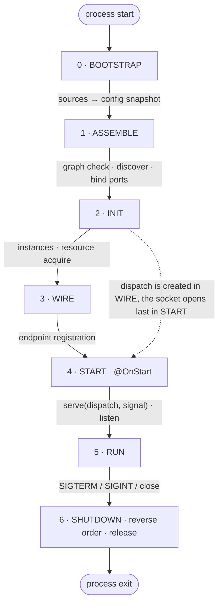

# The composition root and the lifecycle

> **Target state of V1.** Decision logic: entries
> [ideas.md](../../decisions/ideas.md):
> `[2026-07-08] Модульный монолит: фичи, select, дискавери из дерева модулей`,
> `[2026-07-08] Жизненный цикл: фазы, @OnStart/go-live, гарантия dispatch`,
> `[2026-07-08] Kernel/user space; конфиг как token-families`,
> `[2026-07-14] Policy-check на собранном графе`,
> `[2026-07-10] Пакет тестирования (@nestlingjs/testing)` — `check()`.
> `[2026-08-29] Стиль документации: правила, глоссарий, перенос обоснований из design/`,
> `[2026-09-02] Модель композиции: фича, плагин, операция`,
> `[2026-09-03] Декларация приложения: makeApp, assemble(select), AssembledApp`,
> `[2026-09-06] Фаза 0 BOOTSTRAP: источники до сборки, синхронный build(), фабрики без I/O`,
> `[2026-09-06] Ресурсы и роли классов: @Component, @Resource, @Handler; экземпляры на INIT`,
> `[2026-09-06] Переключатели состава: makeSwitch, pick и when, аргумент сборки; формы корня без фич`,
> `[2026-09-06] Пробы: HealthCheck$ и Health$ в ядре, транспорты адаптируют`,
> `[2026-09-06] Логгер ядра: RootLogger$, семейство Logger$ с .auto и child`,
> `[2026-09-06] HTTP-сервер как ресурс: httpServer({ name }), http({ server })`.
> Implementation status: [roadmap](../../decisions/roadmap.md).

## 1. Lifecycle



### 0 · BOOTSTRAP

There is no container yet. The bound configuration sources come up:
env, a file, Vault. A reader is created outside the container,
`init()` of every source is called once, in the order of the bindings.
This is the only place `process.env` is read. The values of the
declared keys are collected into a snapshot: an ordinary object with no
network calls. The result of the phase is the configuration snapshot.

A failed source stops the start with an error naming the source; the
original error sits in `cause`. Retries are declared by the source
itself, as a parameter of its factory (`vault({ retries: 3 })`): it
knows the cost and the fit of a retry, and the kernel has no way to
tell a temporary failure from a permanent one.

The reader lives for the time of `run()`: it enters the graph as a
value provider, and it is closed by an explicit step of the SHUTDOWN
phase, after the container is destroyed.

The assembly argument (the feature selection and the switch values,
§3) is not part of this phase: user code reads it before calling
`assemble`, synchronously and only from `process.env`, through
`load(RootConfig)`.

### 1 · ASSEMBLE

The phase is synchronous and performs no input-output. The assembly
argument decides which features enter the assembly and which switch
branches are picked. Discovery walks the selected features and the
connected plugins and collects the endpoints; there is no global
registry. The same tally is available on its own too:
`app.discover(args?)` parses the argument, unfolds the branches,
resolves the feature selection and runs discovery, then stops, with no
graph built and no configuration sources raised. This is the public
entry of phase 0 and the entry for the document generator
([schemas.md §2.1](./schemas.md)); the graph errors stay with
`check()`. The modules of these units are registered in the container.
The configuration sections are computed from the snapshot and
validated; an invalid value stops the start. `build()` checks the
graph: cycles, missing DI tokens, class roles in their positions, the
feature boundary. There are no instances at this phase. The ports are
bound to their implementations, local or remote through the bus; if
there is nothing to bind to, the assembly fails. The io shapes of the
declarations are checked against the capabilities of the transports,
declared on their declarations ([transports.md](./transports.md)). A
duplicate pattern on one transport instance stops the assembly, naming
both units. Last, the declared `policies:` are checked against the
found endpoints ([pipeline.md §7](./pipeline.md)). Every check of this
phase runs before INIT: a violation has no time to acquire a single
resource.

### 2 · INIT

The graph is walked in topological order, and an instance is created at
every node. A component is constructed through `new`. A resource is
acquired: `await acquire(...deps, signal)` opens a database pool or a
connection to NATS and returns a ready value
([container.md](./container.md)). The consumer of a resource is
created after it and gets the acquired value in its constructor, so
there are no "is it initialized" checks in application code. A failed
acquisition releases what was already acquired, in reverse order, and
drops the start. The acquisition signal is armed by `SIGTERM` during
start. The transports exist, but they do not accept requests yet.
`dispatch` does not exist yet.

### 3 · WIRE

Every endpoint declaration gets its dependencies from the container:
the handler class and the pipeline unit classes
(`endpoint.resolve(resolver)`). Then, for every transport, a table
matching patterns to handlers is assembled, the `dispatch` object. At
this phase `dispatch` already exists, but it has not been passed to
the transports yet. The one exception is the operation bus: it gets its
own `dispatch` right here and subscribes to the subjects of its own
routes ([operations.md](./operations.md)), so ports can already be
called from `@OnStart` on the next phase. A port call before WIRE ends
with an error with a clear message.

### 4 · START

`@OnStart(signal)` is called in topological order. Then the transports
get `serve(dispatch, signal)`: the HTTP transport attaches its handler
to its server, NATS subscribes to subjects (replicas form a queue
group). Servers open their socket last (`listen`,
[transports.md §4](./transports.md)). A transport has no argument-less
`listen()`. `dispatch` is one object made of two parts: `routes`
(projections of the routes, a pattern and an io declaration, with
neither `handler` nor `pipeline`) and `call` (execution).

### 5 · RUN

`port.call` and `emit` travel locally or through the bus, depending on
the dispatch policy. Reloadable configuration sections are updated
(opt-in). The readiness of the application is true only in this phase
(§6).

### 6 · SHUTDOWN

Everything runs in reverse order: the servers stop accepting
connections and drain the open ones, the transports close (the reverse
of START), unfinished requests get a cancellation signal
(`meta.signal` on the handlers and the subscriptions), the `@OnStart`
signal is armed, then `release` of the resources, in reverse
topological order, closes the pools and the connections. Last, after
the container is destroyed, the configuration sources close: the
reader is not managed by a graph node, its lifetime is the lifetime of
`run()`.

### Invariants

The invariants this scheme sets:

| Invariant | Phase |
|---|---|
| `process.env` is read only in the configuration | 0 |
| configuration sources come up before the container, retries are declared by the source | 0 |
| `build()` is synchronous and performs no input-output | 1 |
| a provider factory is synchronous: a `Promise` from it is an assembly error | 1 |
| discovery walks the features and the plugins, not a global registry | 1 |
| a graph edge between two features is an assembly error | 1 |
| transports are graph nodes, declared as instances by the root | 1 |
| the port binding is computed from the graph, not from an external configuration | 1 |
| a duplicate pattern on a transport instance is an assembly error | 1 |
| the consumer of a resource is created after the resource is acquired | 2 |
| `dispatch` is created on phase 3, the socket opens last on phase 4 (a guarantee, not a convention) | 2→3→4 |
| fail-fast: the sources (0), the configuration, the port binding and a missing transport (1), the resource acquisition (2) | 0, 1, 2 |
| the assembly argument is the only input read before the container | 0→1 |
| START in topological order, SHUTDOWN strictly in reverse | 4 ↔ 6 |

The protection against accepting requests early rests on the order of
the phases: `dispatch` is created on WIRE, between INIT and START, and
reaches a transport only as the argument of `serve`, and the socket
opens only after `serve` of every transport. There is no other channel
through which a transport would get declarations with handlers
earlier. So a transport that started accepting requests before START
would have nowhere to route them. Why WIRE is not merged with ASSEMBLE
is the journal entry `[2026-07-08] Жизненный цикл: фазы, @OnStart/go-live, гарантия dispatch`.

## 2. `makeApp` and `assemble`: the composition root

An application is declared by one function and assembled by one
method. Every field of the declaration is optional; the feature
mechanism is optional too (progressive disclosure,
[principles.md](./principles.md)):

```typescript
// app.ts — the application declaration: what it is. The file exports one value
export const app = makeApp({
  endpoints?,   // L0: the endpoints of the root; together with providers or modules, with no features
  providers?,   // the providers of the root (only together with endpoints)
  modules?,     // the modules of the root (only together with endpoints)
  features?,    // L2: the features of the application; the assembly argument picks a subset
  plugins?,     // cross-cutting infrastructure; connected always
  switches?,    // L2: the dictionary of composition switches (§3)
  config?,      // L1: the binding of sources [[src, keys | glob]] (config.md)
  transports?,  // L0+: the declarations of transport and server instances
  intercom?,    // L4: the name of the transport that carries the operations
  logger?,      // the root logger of the application; a ready Logger value
  policies?,    // invariants on the assembled graph; checked at the end
                //   of phase 1 ASSEMBLE — in run(), check() and assembleTest
                //   (pipeline.md §7)
});             // App: app.assemble(args?) · app.check(args?, options?)

// main.ts — how the application starts this process
await app.assemble(args).run();     // AssembledApp: run() · close()

// The dispatch policy of the callers is set by the configuration
// (NESTLING_PORTS_DISPATCH), and the intercom field sets the role of
// operation carrier.
```

`makeApp` returns an application declaration, a branded value checked
at creation, like `makeFeature`. The list of fields is closed. The
composition is described by one of three shapes, and the type checks
this: `{ endpoints, providers? }`, `{ endpoints, modules? }` or
`{ features }`. The first two shapes are the composition of a single
feature with no name; their endpoints are attributed to the internal
unit named `app`, and the providers of the root get the module label
`app`. Cross-cutting infrastructure (logging, tracing, documentation)
is listed in `plugins:` and connected always; features are listed in
`features:` and are selected. Binding the configuration sources is a
field of the declaration: the sources are part of what the application
is, and the differences between environments are expressed by the
coordinates of the sources themselves ([config.md §3](./config.md)).
The `logger:` field sets the root logger, the only way to replace the
kernel's `ConsoleLogger`. The value is ready: the root exists before
the graph and cannot depend on its nodes, and the records of every
phase, including the assembly warnings, go into it
([container.md](./container.md), "The kernel logger"). Substituting
graph nodes (`overrides`) exists only on the test root
`assembleTest` ([testing.md](./testing.md)); `makeApp` knows nothing
about substitutions and does not pass them into the container.

The assembly argument (the feature selection and the switch values)
belongs to the assembly, not to the declaration: it changes the
composition of the process, not of the application. `app.assemble(args?)`
is synchronous and reads nothing; it returns an `AssembledApp`, and
`run()` runs the phases. The type of the argument is derived from the
declaration: `{ features?, ...switch values from switches: }`; the
string shape `assemble('all')` sets only the feature selection.

The declaration and the assembled application provide three methods:

| Method | Where | Phases | What it does |
|---|---|---|---|
| `run()` | `AssembledApp` | 0–5 | brings the application to RUN and stays there; sets up signal handlers |
| `check(args?, options?)` | `App` | 0–1 | a structural check: the graph is checked, no instances are created, no resources are acquired; checks `policies:`; returns a report on the composition (the features, the switches, the endpoints by transport with `detached` reasons, the transports, the map of operations), and throws the same errors `run()` would throw at these phases. `options.config` replaces the sources of the declaration, as in `assembleTest` |
| `close()` | `AssembledApp` | 6 | SHUTDOWN in strict reverse order; idempotent |

`check()` lives on the declaration, not on the assembled application:
it is "assemble and discard", it does not need the result of the
assembly. It does not keep its graph and does not affect a later
`assemble()` of the same declaration. This is why it checks the matrix
of topologies in CI ([testing.md §6](./testing.md)).

Application levels:

| Level | What is added | What is still missing |
|---|---|---|
| L0 | endpoints, providers and a transport in the root | features, selection, configuration sections, operations, an intercom |
| L1 | typed configuration sections | features, selection, operations, an intercom |
| L2 | features, selection and composition switches | operations, an intercom; every feature in one process |
| L3 | operations and their callers; every feature in one process | an intercom; calls travel through the in-process `dispatch` |
| L4 | `intercom:` on a declared `nats()` | — this is a split deployment |

**The code of the endpoints and the providers does not change between
levels.** Moving from L0 to L2 rewrites only `app.ts`: the endpoints
and the providers of the root move into features. Splitting into
processes at L4 is a different composition root and a different
configuration, not different business code. An L0 application mentions
neither features, nor selection, nor operations, nor an intercom: an
unused level costs nothing, neither in code nor in concepts.

## 3. Progression L0–L4

Services are declared as classes with a role
([container.md](./container.md)), declarations as values
([endpoints.md](./endpoints.md), the handler shapes are there too).

### L0 — endpoints and the transport

```typescript
// orders.service.ts — a component: a class, its own DI token
@Component()
export class OrdersService {
  create(dto: NewOrder): Order { /* ... */ }
}

// create-order.endpoint.ts — the handler and the declaration
@Handler([OrdersService])
export class CreateOrderHandler {
  constructor(private orders: OrdersService) {}
  async handle(input: NewOrder): Output<Order> {
    return this.orders.create(input);
  }
}

export const CreateOrder = httpEndpoint.post('/orders', {
  input: NewOrder,
  output: Order,
  handler: CreateOrderHandler,
});

// app.ts — the application declaration: the composition of one feature with no name
export const app = makeApp({
  endpoints: [CreateOrder],
  providers: [OrdersService],
  transports: [http()],          // the port and the host come from the HTTP_PORT, HTTP_HOST section
});

// main.ts — start
await app.assemble().run();
```

### L1 — typed configuration

A configuration section is an object where every field is matched to a
schema. It does not know where its value will come from: the sources
are bound at the root. Application code does not read `process.env`.
The full model of the configuration is in [config.md](./config.md).

```typescript
// orders.config.ts — only OrdersConfig.keys is exported out of the package
export const OrdersConfig = makeConfig('orders', {
  maxItems:    z.coerce.number().default(100),   // key ORDERS_MAX_ITEMS
  databaseUrl: from('DATABASE_URL', z.url()),     // a shared key, with no prefix
});

// orders.errors.ts — a declared failure (errors.md)
export const OrderLimitReached = makeFail('bad_request:order_limit', {
  details: z.object({ max: z.number() }),
});

// orders.service.ts — the section is injected as a typed object
@Component([OrdersConfig])
export class OrdersService {
  constructor(private cfg: Config<typeof OrdersConfig>) {}
  create(dto: NewOrder): Order | Fail {
    if (dto.items.length > this.cfg.maxItems) return OrderLimitReached({ max: this.cfg.maxItems });
    /* ... */
  }
}

// app.ts — the single source of env: nothing about the configuration is written in the declaration.
// The sections are checked at assembly; an invalid configuration drops the start.
export const app = makeApp({
  endpoints: [CreateOrder],
  providers: [OrdersService],
  transports: [http()],
});
// A second source is connected this way:
//   config: [[file('config.yaml'), [OrdersConfig.keys]]]
```

### L2 — features, selection and switches

```typescript
// features.ts — a feature is a value: a name, a composition and its endpoints.
// A feature has no dependsOn field: the link with its neighbors follows
// from the declared operations, it is not duplicated as a list of names
export const OrdersFeature  = makeFeature({ name: 'orders',  modules: [OrdersModule] });
export const BillingFeature = makeFeature({ name: 'billing', modules: [BillingModule] });

// config.ts — the assembly argument is read before the container
export const RootConfig = makeConfig('app', {
  features: z.string().default('all'), // key APP_FEATURES: 'all' | 'orders,billing'
});

// app.ts — the composition of the application does not depend on what this process selects
export const app = makeApp({
  features: [OrdersFeature, BillingFeature],
  plugins: [appLogging],         // infrastructure is connected always
  transports: [http()],
});

// main.ts — load() reads the assembly argument before the container:
// synchronously and only from process.env; the bound sources do not
// take part in this read.
const cfg = load(RootConfig);
await app.assemble(cfg.features).run();   // 'all' locally, 'orders' in a separate pod
```

An unselected feature is absent entirely: its providers are not
created, its endpoints are not registered (discovery sees only the
selected units). Everything works in one process, no intercom is
needed.

Feature selection shapes: `'all'`, `'orders,billing'` (spaces around
the names are ignored), `['orders','billing']` and the object shape
`{ features, includeDeps }`. When `features` is set and no selection is
given, every feature is selected. The string shape stays, because the
selection arrives from an environment variable, string by nature.

`includeDeps: true` closes the selection over the **called
operations**: a feature that implements a called operation of the
`request` or `command` kind is connected on its own, and the actual
composition is printed at start. Events do not take part in the
closure: an event has zero or more subscribers, and the absence of a
subscriber in this process is a legitimate topology, not a shortfall.

A mention of `.caller` or `.emitter` counts as a call, both in `deps`
of a declaration and in the dependencies of a provider: a caller is an
ordinary DI token. Switch branches are resolved before the closure, so
the closure sees the already-selected composition.

The assembly fails on ASSEMBLE in four cases: the name is unknown (the
error lists the available ones), two different features carry one
name, the selection is empty (`''` or `[]`; "nothing" is expressed by
no features), the selection is given with no `features`.

### Composition switches

A switch is a value that picks one of the declared composition
branches, by a value known before assembly. Both the module and the
root import it, like a configuration section.

```typescript
// switches.ts
export const Storage = makeSwitch('storage', ['s3', 'local']);   // an enumeration
export const Audit   = makeSwitch('audit');                      // 'on' | 'off'
export const Debug   = makeSwitch('debug', { default: 'off' });

// storage.module.ts — both branches are listed as a table
export const StorageModule = makeModule({
  name: 'module:storage',
  providers: [
    UploadsService,
    Storage.pick({ s3: [S3Client, S3Storage], local: [LocalStorage] }),
    Audit.when(StorageAudit),              // the same as pick({ on: StorageAudit, off: [] })
  ],
});

// uploads.feature.ts
export const UploadsFeature = makeFeature({
  name: 'uploads',
  modules: [StorageModule],
  endpoints: [UploadFile, Debug.when([DumpUploads, ResetUploads])],
});

// app.ts — the dictionary of switches is declared next to the features
export const app = makeApp({
  features: [UsersFeature, UploadsFeature],
  plugins: [appLogging, Audit.when(appAudit)],
  transports: [http(), Debug.when(http({ name: 'admin' }))],
  switches: [Storage, Audit, Debug],
});

// config.ts — a switch has a schema for its values, with a default
export const RootConfig = makeConfig('app', {
  features: z.string().default('all'),   // APP_FEATURES
  storage: Storage.schema,               // APP_STORAGE: 's3' | 'local', required
  audit: Audit.schema,                   // APP_AUDIT: 'on' | 'off', required
  debug: Debug.schema,                   // APP_DEBUG, defaults to 'off'
});

// main.ts — the fields are named like the switches, so cfg fits as a whole
await app.assemble(load(RootConfig)).run();
```

- An enumeration has one method, `pick(table)`. The table lists every
  value; an incomplete table does not compile. A two-position switch
  has `pick({ on, off })` and `when(x)`. A branch is one value, an
  array, or an empty array.
- A switch is allowed in any list of units: `providers:`, the
  `modules:` of a feature, the `dependsOn:` of a module, `endpoints:`,
  `plugins:` and `transports:` of the root. It has no place in
  `features:`: the assembly argument picks the feature composition. It
  has no place in `policies:` either: an invariant either holds or it
  does not.
- `switches:` of the root declares the dictionary. The type of the
  `assemble` argument is derived from it; the `.schema` of a switch
  describes a field of `RootConfig`, and `load(RootConfig)` fits the
  argument as a whole, when the field names match the switch names.
- The assembly fails on ASSEMBLE if a value is not from the dictionary
  (the error lists the allowed ones), if `pick` sits on a switch that
  is not in `switches:`, if two switches carry one name, if a value
  with no default is not passed.
- A switch has no DI token: the choice cannot be injected, the
  composition does not leak into application code. `check()` gets a
  measurement for every switch, and the start line prints the choice
  next to the features:
  `[nestling] features: users, uploads; storage=s3 metrics=on debug=off;`
  `transports: http`.

### The feature boundary

A feature is reached by **operations**, a plugin by DI tokens. The rule
follows from one criterion: a DI token does not survive a process
boundary, and an operation does, since it has an address and schemas,
so a call works the same way through `dispatch` and through the
intercom.

Hence three checks on the assembled graph:

| Edge | Verdict |
|---|---|
| a provider of a feature → a provider of another feature | error: reaching it is allowed only through an operation |
| a provider of a feature → a provider of a plugin | allowed: a plugin exists in every process |
| a provider of a plugin → a provider of a feature | error: infrastructure does not depend on business logic |

A module reachable from two or more features must be a plugin: while
it has two owners, an edge into it cannot be classified. The error
names both features and suggests moving the module into `plugins:`.

### L3 — operations and their callers

Operations, callers and the rules for using them are in
[operations.md](./operations.md).

```typescript
// billing/operations.ts — billing owns the operation, consumers import it
export const ChargeCard = makeRequest({   // request-response, may return Fail
  name: 'billing.charge',
  input:  z.object({ orderId: z.string(), amount: z.number() }),
  output: z.object({ chargeId: z.string() }),
});

// billing implements the operation; the binding is computed at assembly
@Handler([PaymentGateway])
class ChargeCardHandler implements Handler<typeof ChargeCard> {
  constructor(private gw: PaymentGateway) {}
  async handle(input: ChargeCardInput, meta: HandlerMeta) {
    return { chargeId: await this.gw.charge(input, meta.signal) };
  }
}
export const ChargeCardImpl = implement(ChargeCard, { handler: ChargeCardHandler });

// orders calls the port: an ordinary dependency of the handler
@Handler([OrdersService, ChargeCard.caller])
class CreateOrderHandler {
  constructor(
    private orders: OrdersService,
    private billing: Port<typeof ChargeCard>,
  ) {}
  async handle(input: NewOrder, meta: HandlerMeta): Output<Order, typeof CardDeclined> {
    const charge = await this.billing.call({ orderId: input.id, amount: input.total }, meta);
    if (charge.isFail) return charge;    // a neighbor's failure is an ordinary Fail, not an exception
    return this.orders.create(input);
  }
}

// main.ts is unchanged since L2: the binding of the caller is computed from the graph.
// billing is selected, so ChargeCard.caller is bound to the local implementation.
```

### L4 — intercom and split deployment

```typescript
// app.ts — only the declaration and the configuration change; the endpoints stay the same
export const app = makeApp({
  features: [OrdersFeature, BillingFeature],
  transports: [
    http(),
    nats({ name: 'events' }),            // a transport instance declaration
  ],                                     // the HTTP port and the NATS addresses come from their sections
  intercom: 'events',                    // the role of operation carrier
});

// main.ts
const cfg = load(RootConfig);            // only the assembly argument is read before assembly
await app.assemble(cfg.features).run();  // 'orders' here, 'billing' in another pod

// The dispatch policy is set by configuration, not by a field of the root.
// NESTLING_PORTS_DISPATCH=local-first (the default): implementations from this
// process are called directly, the rest through the intercom.
```

`intercom:` **assigns a role by reference** to an already-declared
transport, it does not declare a second one. Only transports that
carry operations fit; HTTP does not fit this role, and the compiler
checks this. A declared bus with no assigned role is an assembly
error: the connection is spent, and there is nothing to carry.

With `assemble('orders')`, the billing feature is not selected in this
process, and `ChargeCard.caller` binds to a remote caller over NATS: an
unselected owner of an operation means it runs in another pod. Billing
serves `billing.charge` in its own pod; its replicas form a queue
group. The same root with `assemble('all')` brings up both features in
one process: `request` and `command` are called directly through
`dispatch`, while `event` still goes through the intercom, because the
subscribers of an event may live in other pods too, and losing them
silently is not allowed. With no `intercom:`, the application works on
the in-process bus with no changes to the declarations and the calls.
One binary serves different topologies through the assembly argument
and the configuration.

Both topologies on one code base live in `examples/split-nats`: one
root, one set of declarations, a different assembly argument.

## 4. Transports and servers

A transport is an ordinary graph node: a singleton with dependencies and
a lifecycle. The root lists **instance declarations**: `http()`,
`http({ name: 'admin' })`, `nats({ name: 'events' })`. Every instance
gets its own name, and a declaration picks its own through `on:`; with
no `on:` this is `'default'`. There is no limit of "one HTTP per
assembly".

A server is a resource that holds a socket. The HTTP transport attaches
to a server; with no explicit server, it declares its own, under the
same name. Several transports on one socket get one server:

```typescript
transports: [http()],                                  // the default server: HTTP_PORT, HTTP_HOST

const api = httpServer({ name: 'api' });               // HTTP_API_PORT, HTTP_API_HOST
transports: [http({ server: api }), graphql({ server: api })],
```

A declaration references a transport by DI token; if there is no
instance in the graph, the assembly fails on ASSEMBLE. A server and a
transport read the port and the addresses from their own configuration
sections (`HTTP_PORT`, `NATS_SERVERS`); there are no port literals in
the root. The transport interface, the server and the byte level
(compression, CORS, parsing) are in [transports.md](./transports.md).

## 5. The plugin: cross-cutting infrastructure

Cross-cutting infrastructure — logging, tracing, documentation, a
client of an external service — is declared as a **plugin**: `makePlugin`
and the root's `plugins:` field. The role gives exactly two things: a
place of its own in the root, and the rule "a plugin is reached by DI
tokens". It brings no new mechanisms, no configuration hook, no ambient
middleware, no registry of the infrastructure raised so far:

| Part of a plugin | Nestling mechanism |
|---|---|
| connection in the root | `plugins:` — the unit exists in every process and takes no part in the feature selection |
| plugin parameters | a function that returns a value: `logging({ … })`; the value is created once and imported ([container.md](./container.md)) |
| plugin configuration | a `makeConfig` section, declared by the plugin itself; only its `.keys` is exported ([config.md](./config.md)) |
| dependency on another plugin | `dependsOn:` with references **only to plugins**; a parametrized dependency is expressed by a DI token |
| "only for these transports" | an ordinary dependency on the DI token of a transport; a missing instance drops the assembly on ASSEMBLE |
| "a plugin that knows the composition of the application" | a dependency on `Discovery$`: the composition of the application as an ordinary graph node (below) |
| middleware on every endpoint | an exported pipeline layer plus the `everyEndpoint(…).hasLayer(ref)` policy ([pipeline.md §7](./pipeline.md)) |
| formatting and sending errors | `.catch` and `.finally` units of the same layer ([errors.md](./errors.md)) |
| enriching the context | a `.pre` unit of the layer; reading from deep in the graph is done by the readers of the asynchronous context |

The name of a plugin matches the name of the npm package that supplies
it: otherwise two foreign packages would drop the assembly with a name
collision, and there would be no way to fix it, since both names are
set by their authors. Endpoints are allowed on a plugin:
`@nestlingjs/openapi` is infrastructure and declares a utility endpoint
with the document.

### The composition of the application as a graph node

The assembly registers the result of discovery as a value provider
under the DI token `Discovery$`, always, unconditionally. This is the
same value `App` computed before the graph was built; a second pass
does not run. Through `Discovery$`, a plugin sees the selected
topology, with no need to duplicate the assembly argument in the root.
Outside the graph, the same value is given by `app.discover(args?)`;
there is no other entry into discovery, since the assembly argument
belongs only to the declaration, and without it the composition of the
document would drift from the composition of the process. The value is
read-only: the lists are frozen, the mutators of the map throw. The
injectable discovery is a surface for introspection, not an extension
point: the composition of the application is set by the `features:` and
`plugins:` lists, the switches and the feature selection, not by the
graph. The first consumer is documentation generation
([schemas.md §2.1](./schemas.md)).

### A plugin parameter, a switch and a configuration section

The parameter of a plugin function is a composition-root decision: what
the instance is named, what the service name in the records is. It is
known at assembly and visible in a review diff. A switch is a
deployment decision about the composition of the graph: which
implementation is picked, whether a module is on (§3). A configuration
section, which a module declares itself, is an environment decision
about values: addresses, ports, log levels, timeouts. Its values come
from sources, are checked at assembly, and can be reloadable. The
criterion for the author of a plugin: what changes the set of
providers is a switch or a parameter; what changes only values is a
section.

### Why a plugin is always connected

A plugin is reachable by everyone through DI tokens, and a DI token does
not survive a process boundary. So a unit reached by DI token must
exist in every process, or the assembly would break the first time
processes are split. Hence its place in the root: `plugins:` takes no
part in the feature selection.

Features in one process get one instance of every plugin; features in
different processes get one instance per process. No special code is
needed for this: the container and the feature selection already work
this way. "Present in the process" means only that the provider is in
the graph; only someone who imported the DI token can inject it.

A plugin does not depend on a feature, and this rule is symmetric to
the main one. It gets application data through two ordinary paths: a
parameter at declaration (`logging({ service: 'orders-api' })`), or a DI
token declared by the plugin itself and implemented by anyone.

### Cross-cutting behavior: a layer plus a policy

An infrastructure module exports a pipeline layer as a value, endpoints
compose it explicitly, and a policy on the assembled graph guarantees
that the layer is everywhere:

```typescript
// infrastructure.ts — the value is created once and listed in the root
export const appLogging = logging({ service: 'orders-api' });

// app.ts
export const app = makeApp({
  features: [OrdersFeature, OpsFeature],
  plugins: [appLogging],
  transports: [http()],
  policies: [
    everyEndpoint({ transport: HttpTransport$('default') }).hasLayer(
      observability,
    ),
  ],
});
```

There are no pipeline levels for the whole application or for a unit
([pipeline.md](./pipeline.md)): a layer is always visible in the
declaration of an endpoint. A forgotten layer is caught on ASSEMBLE,
naming the endpoint. A conscious exception is recorded with a reason
(`detached: '<why>'`), visible in the diff and in the `check()` report.

## 6. Kernel nodes: the probes and the logger

The kernel registers several nodes always, with no fields in `makeApp`:
the configuration ([config.md](./config.md)), the asynchronous context
and the ports ([container.md](./container.md),
[operations.md](./operations.md)), the probes and the logger. Their DI
tokens are exported, their implementations are not.

### Probes

`HealthCheck$(name)` is a kernel DI token family. A contribution is
registered by an ordinary member provider:
`classProvider(HealthCheck$('db'), DbHealthCheck)`. The interface of a
contribution: `critical: boolean` and `check(signal): Promise<HealthStatus>`.
A resource with a `health` method registers a contribution itself,
under the identifier of its node ([container.md](./container.md)). The
contributions of unselected features are absent from the list by the
same mechanism as their providers.

`Health$` is a kernel node with two methods:

- `liveness()` always returns `ok`: the response itself is the sign of
  life of the process.
- `readiness(signal)` returns a report: the phase, the list of checks
  with their outcomes, the total. The total is `ready` only in the RUN
  phase, and only when every critical check succeeds. Before RUN and on
  SHUTDOWN the total is `not_ready`, and the checks do not run.

The node reads the current phase through a function given to it by the
application runtime. There is no DI token for the phase: injecting the
current phase would invite branching on it in application code, and the
whole point of the phase model is to make such branching unnecessary.
The test root stops after WIRE, but `testApp.call` is itself a request
being received, so in a test run the function answers `RUN`
([testing.md](./testing.md)).

The node names every contribution by name: the name of a check lives on
the DI token of the member, not on the contribution itself. The list of
members and the list of resources with `health` are given by the
container builder through its reading methods, and the kernel registers
the contribution nodes ([container.md](./container.md)).

The checks run on demand of a probe, each with its own timeout, and the
result is cached for a short time, so frequent probes do not turn into
load on the database. The timeout and the cache time are set by the
`nestlingHealth` kernel section (`NESTLING_HEALTH_TIMEOUT`,
`NESTLING_HEALTH_CACHE`). The outcomes of the checks are cached, not
the total: the phase changes with no part of them. The report carries
the name, the criticality, the status, the duration and the reason for
a failure; there is no error message or stack in it, the original goes
into `Logger$('nestling:health')`.

The transport gives out the probes as a thin layer over `Health$`. The
HTTP package exports the `httpProbes()` plugin, with two endpoints,
`GET /healthz` and `GET /readyz`: with no pipeline, `detached`, `hidden`
([transports.md §4](./transports.md)). There is no separate start
state: a failed INIT ends the process.

### The logger

`RootLogger$` is the DI token of the root logger, with the `Logger`
interface ([container.md](./container.md), the interface is there too).
The kernel module registers `ConsoleLogger` as the default; an
application provider under the same DI token replaces the default with
no duplicate error. The level and the format are set by the
`nestlingLog` kernel section: `NESTLING_LOG_LEVEL` (`debug` | `info` |
`warn` | `error`, `info` by default) and `NESTLING_LOG_FORMAT`
(`text` | `json`, `text` by default). Records go to `stderr`: for a
CLI transport, `stdout` is taken by the result of the command. The
implementation reads the request identifier from `Ctx(RequestId)` and
adds it as the `requestId` field.

`Logger$(scope)` is a family with the recipe `root.child({ scope })`.
`Logger$.auto` gives a member named after the consumer. Replacing the
root changes every member; the consumers do not see this. The kernel
writes only through `Logger$('nestling')` and the scopes
`nestling:<area>`: `nestling:config`, `nestling:ports`, `nestling:bus`,
`nestling:nats`, `nestling:openapi`. Every area is a graph node,
visible in the visualization.

| Event | Level |
|---|---|
| the composition at start, the selection closure over calls, `detached` endpoints, hidden OpenAPI endpoints, the stop signal | `info` |
| short-lived operations, an idle intercom, configuration and container warnings | `warn` |
| undeclared failures, port failures, bus and NATS delivery failures | `error`, the original in `err` |

The kernel has no separate output hooks: it does not touch `console`
outside `ConsoleLogger`. The warnings of the configuration reader pile
up until the logger appears and go into it right after `build()`; the
assembly takes the container warnings from
`BuiltContainer.warnings`. Standalone paths with no `App`
(`makeDispatch`, `new InProcessBus()`) use `ConsoleLogger` with its
defaults, so an undeclared failure is not swallowed silently. In a
test, `spyLogger()` intercepts the records by substituting `RootLogger$`
([testing.md](./testing.md)). Adapters to pino and similar loggers are
satellite packages.
