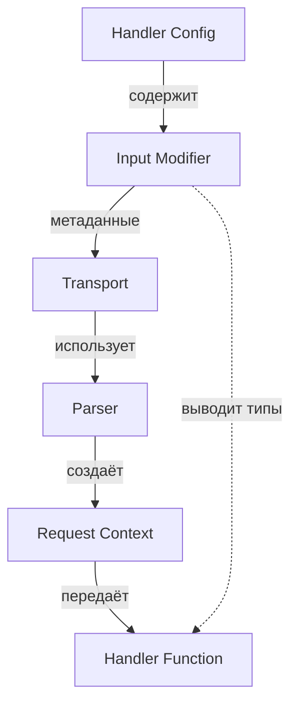
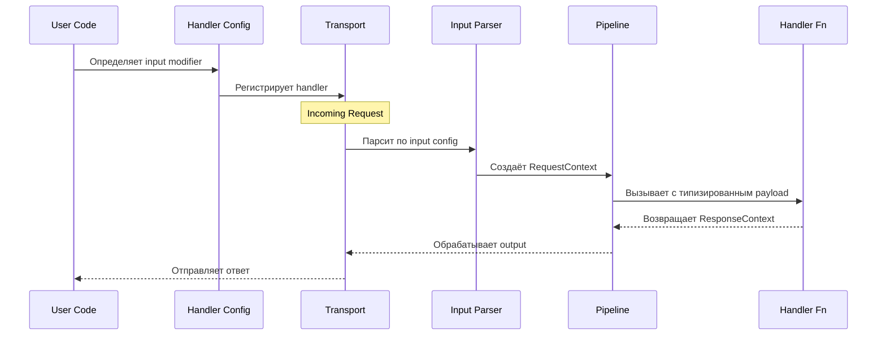
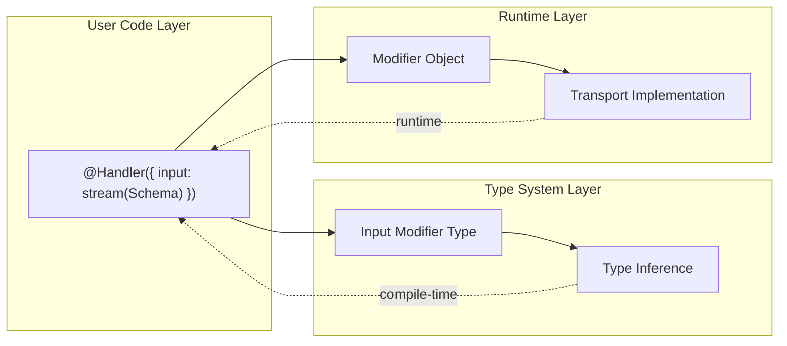

# Type-Safe Input/Output Модификаторы для Nestling Транспортов

> **Версия:** 1.0  
> **Дата:** 2026-01-07  
> **Статус:** Implemented

## Содержание

1. [Обзор](#обзор)
2. [Мотивация](#мотивация)
3. [Архитектура](#архитектура)
4. [Type System](#type-system)
5. [API Reference](#api-reference)
6. [Примеры использования](#примеры-использования)
7. [Реализация транспортами](#реализация-транспортами)
8. [FAQ](#faq)

---

## Обзор

Система type-safe модификаторов для конфигурации input/output хэндлеров в Nestling транспортах. Позволяет декларативно описывать формат данных с автоматическим выводом типов на этапе компиляции.

### Ключевые возможности

- **Type Safety**: Полная проверка типов на этапе компиляции
- **Универсальность**: Работает для всех транспортов (HTTP, CLI, gRPC, WebSocket)
- **Композируемость**: Модификаторы можно комбинировать
- **Декларативность**: Конфигурация описывает ЧТО, транспорт решает КАК
- **Расширяемость**: Легко добавить новые модификаторы

---

## Мотивация

### Проблема

В разных транспортах данные могут приходить в различных форматах:
- JSON body
- Бинарные данные
- Текстовые потоки
- Файлы + структурированные данные
- Streaming chunks

При этом нужно:
1. Сохранить type safety (типы должны выводиться автоматически)
2. Обеспечить универсальность (одна абстракция для всех транспортов)
3. Избежать дублирования кода

### Примеры из реальной жизни

**HTTP**: Загрузка файлов + форма регистрации
```typescript
input: withFiles(FormSchema)
→ payload: { data: Form; files: FilePart[] }
```

**CLI**: Обработка stdin + аргументы командной строки
```bash
cat data.json | cli process --format=pretty
```

**gRPC**: Streaming upload с метаданными
```protobuf
message UploadRequest {
  FileMetadata metadata = 1;
  stream bytes content = 2;
}
```

Все эти случаи имеют общий паттерн: **структурированные данные + payload (простой или стриминговый) + опционально файлы**.

---

## Архитектура

### Общая схема



### Поток данных



### Слои абстракции



---

## Type System

### Базовые типы

```typescript
/**
 * Примитивные типы входных данных
 */
type IOPrimitive = 'binary' | 'text';

/**
 * Input может быть:
 * - Schema (объект с валидацией)
 * - Примитив ('binary' | 'text')
 * - Модификатор (stream, withFiles, etc)
 */
type Input<T = unknown> = 
  | T                       // Schema
  | IOPrimitive             // Primitives
  | StreamModifier<T>       // stream(schema)
  | WithFilesModifier<T>    // withFiles(schema)
  | FilesModifier;          // files()

/**
 * Output может быть:
 * - Schema (объект с валидацией)
 * - Примитив ('binary' | 'text')
 * - Stream модификатор
 */
type Output<T = unknown> =
  | T                       // Schema
  | IOPrimitive             // Primitives
  | StreamModifier<T>;      // stream(schema)
```

### Модификаторы

```typescript
/**
 * Stream модификатор - данные приходят потоком
 */
interface StreamModifier<T> {
  readonly __type: 'stream';
  readonly __schema: T;
  
  // Метаданные для транспорта
  toJSON(): { type: 'stream'; schema: T };
}

/**
 * WithFiles модификатор - структурированные данные + файлы
 */
interface WithFilesModifier<T> {
  readonly __type: 'withFiles';
  readonly __schema: T;
  readonly __filesOpts?: {
    buffer?: boolean;  // загружать файлы в память
  };
  
  toJSON(): { 
    type: 'withFiles'; 
    schema: T; 
    filesOpts?: { buffer?: boolean };
  };
}

/**
 * Files модификатор - только файлы без схемы
 */
interface FilesModifier {
  readonly __type: 'files';
  readonly __buffer?: boolean;
  
  toJSON(): { type: 'files'; buffer?: boolean };
}
```

### Вывод типов

```typescript
/**
 * Выводит TypeScript тип из Input конфигурации
 */
type InferInput<I> = 
  // Примитивы
  I extends 'binary' ? Buffer :
  I extends 'text' ? string :
  
  // Stream модификатор
  I extends StreamModifier<infer S> 
    ? AsyncIterator<Infer<S>> :
  
  // WithFiles модификатор
  I extends WithFilesModifier<infer S> 
    ? { data: Infer<S>; files: FilePart[] } :
  
  // Files модификатор
  I extends FilesModifier 
    ? FilePart[] :
  
  // Undefined
  I extends undefined 
    ? undefined :
  
  // Schema (по умолчанию)
  Infer<I>;

/**
 * Выводит TypeScript тип из Output конфигурации
 */
type InferOutput<O> =
  // Примитивы
  O extends 'binary'
    ? Buffer
    : O extends 'text'
      ? string
      : // Stream модификатор
        O extends StreamModifier<infer S>
        ? AsyncIterator<Infer<S>>
        : // Undefined
          O extends undefined
          ? undefined
          : // Schema (по умолчанию)
            Infer<O>;

/**
 * Вывод типа из схемы (zod, yup, etc)
 */
type Infer<S> = S extends { _output: infer O } 
  ? O  // zod
  : S extends { __outputType: infer O }
  ? O  // yup
  : unknown;
```

### FilePart интерфейс

```typescript
/**
 * Представляет файл в запросе
 */
interface FilePart {
  /** Имя поля формы */
  field: string;
  
  /** Имя файла */
  filename: string;
  
  /** MIME-тип */
  mime: string;
  
  /** Поток данных файла */
  stream: Readable;
  
  /** Размер файла (если известен) */
  size?: number;
}
```

---

## API Reference

### Модификаторы

#### `stream<T>(schema: T): StreamModifier<T>`

Обрабатывает входные данные как поток.

**Параметры:**
- `schema` - схема для валидации каждого chunk'а (или 'binary'/'text')

**Возвращаемый тип:**
- `AsyncIterator<Infer<T>>` - асинхронный итератор

**Примеры:**
```typescript
// JSON chunks
input: stream(ChunkSchema)
→ payload: AsyncIterator<Chunk>

// Binary stream
input: stream('binary')
→ payload: AsyncIterator<Buffer>

// Text stream
input: stream('text')
→ payload: AsyncIterator<string>
```

**Транспорты:**
- HTTP: Читает request body как stream
- CLI: Читает stdin как stream
- WebSocket: Каждое сообщение = chunk
- gRPC: Server streaming

---

#### `withFiles<T>(schema: T, opts?): WithFilesModifier<T>`

Обрабатывает структурированные данные + файлы.

**Параметры:**
- `schema` - схема для валидации структурированных данных
- `opts.buffer` - загружать файлы в память (по умолчанию false)

**Возвращаемый тип:**
- `{ data: Infer<T>; files: FilePart[] }`

**Примеры:**
```typescript
// Form data + files
input: withFiles(FormSchema)
→ payload: { data: Form; files: FilePart[] }

// Buffered files
input: withFiles(FormSchema, { buffer: true })
→ payload: { data: Form; files: FileBuffer[] }
```

**Транспорты:**
- HTTP: Multipart form-data
- CLI: Args + файлы через --file или stdin
- gRPC: Message + streaming chunks

---

#### `files(opts?): FilesModifier`

Обрабатывает только файлы без структурированных данных.

**Параметры:**
- `opts.buffer` - загружать файлы в память (по умолчанию false)

**Возвращаемый тип:**
- `FilePart[]`

**Примеры:**
```typescript
// Multiple file upload
input: files()
→ payload: FilePart[]

// Buffered files
input: files({ buffer: true })
→ payload: FileBuffer[]
```

**Транспорты:**
- HTTP: Multipart без form fields
- CLI: Только файлы

---

### Handler Config

```typescript
interface HandlerConfig<I, M, O> {
  /** Имя транспорта */
  transport: string;
  
  /** Паттерн маршрута */
  pattern: string;
  
  /** Конфигурация входных данных */
  input?: Input<I>;
  
  /** Схема метаданных */
  metadata?: M;
  
  /** Конфигурация выходных данных */
  output?: Output<O>;
  
  /** Функция-обработчик */
  handle: HandlerFn<
    InferInput<I>,
    Infer<M>,
    InferOutput<O>
  >;
}
```

---

## Примеры использования

### 1. Простой JSON endpoint

```typescript
import { z } from 'zod';

const CreateUserInput = z.object({
  name: z.string(),
  email: z.string().email(),
});

const UserOutput = z.object({
  id: z.string(),
  name: z.string(),
  email: z.string(),
});

@Handler({
  transport: 'http',
  pattern: 'POST /users',
  input: CreateUserInput,
  output: UserOutput,
})
class CreateUserHandler {
  async handle(
    payload: z.infer<typeof CreateUserInput>,  // автовывод типа!
  ): Promise<ResponseContext<z.infer<typeof UserOutput>>> {
    return {
      status: 201,
      value: {
        id: crypto.randomUUID(),
        ...payload,
      },
    };
  }
}
```

### 2. Streaming endpoint

```typescript
const LogChunk = z.object({
  timestamp: z.number(),
  level: z.enum(['info', 'warn', 'error']),
  message: z.string(),
});

@Handler({
  transport: 'http',
  pattern: 'POST /logs/stream',
  input: stream(LogChunk),
})
class StreamLogsHandler {
  async handle(
    payload: AsyncIterator<z.infer<typeof LogChunk>>,  // AsyncIterator!
  ): Promise<ResponseContext> {
    for await (const chunk of payload) {
      console.log(`[${chunk.level}] ${chunk.message}`);
    }
    
    return { status: 200, value: { processed: true } };
  }
}
```

### 3. File upload с формой

```typescript
const UploadForm = z.object({
  title: z.string(),
  description: z.string().optional(),
  category: z.enum(['image', 'video', 'document']),
});

@Handler({
  transport: 'http',
  pattern: 'POST /upload',
  input: withFiles(UploadForm),
})
class UploadHandler {
  async handle(
    payload: {
      data: z.infer<typeof UploadForm>;
      files: FilePart[];
    },
  ): Promise<ResponseContext> {
    const { data, files } = payload;
    
    // Обработка файлов
    for (const file of files) {
      await pipeline(
        file.stream,
        fs.createWriteStream(`/uploads/${file.filename}`)
      );
    }
    
    return {
      status: 201,
      value: {
        title: data.title,
        filesUploaded: files.length,
      },
    };
  }
}
```

### 4. Binary upload

```typescript
@Handler({
  transport: 'http',
  pattern: 'PUT /files/:id',
  input: stream('binary'),
})
class UploadBinaryHandler {
  async handle(
    payload: AsyncIterator<Buffer>,  // Buffer chunks!
  ): Promise<ResponseContext> {
    const chunks: Buffer[] = [];
    
    for await (const chunk of payload) {
      chunks.push(chunk);
    }
    
    const file = Buffer.concat(chunks);
    // Сохраняем file...
    
    return { status: 200, value: { size: file.length } };
  }
}
```

### 5. CLI с stdin

```typescript
const ProcessArgs = z.object({
  format: z.enum(['json', 'yaml', 'toml']),
  output: z.string().optional(),
});

@Handler({
  transport: 'cli',
  pattern: 'process',
  input: withFiles(ProcessArgs),  // args + stdin
})
class ProcessFileHandler {
  async handle(
    payload: {
      data: z.infer<typeof ProcessArgs>;
      files: FilePart[];
    },
  ): Promise<ResponseContext> {
    const { data, files } = payload;
    
    // files[0] = stdin stream
    const stdinData = await readStream(files[0].stream);
    
    // Конвертируем формат
    const converted = convertFormat(stdinData, data.format);
    
    return { status: 0, value: converted };
  }
}
```

### 6. WebSocket streaming

```typescript
const ChatMessage = z.object({
  user: z.string(),
  text: z.string(),
  timestamp: z.number(),
});

@Handler({
  transport: 'ws',
  pattern: 'chat',
  input: stream(ChatMessage),
  output: stream(ChatMessage),
})
class ChatHandler {
  async handle(
    payload: AsyncIterator<z.infer<typeof ChatMessage>>,
  ): Promise<ResponseContext<AsyncIterator<ChatMessage>>> {
    async function* processMessages() {
      for await (const msg of payload) {
        // Broadcast to all clients
        yield {
          ...msg,
          timestamp: Date.now(),
        };
      }
    }
    
    return {
      status: 200,
      stream: processMessages(),
    };
  }
}
```

---

## Реализация транспортами

### HTTP Transport

```typescript
class HttpTransport {
  endpoint(config: HandlerConfig) {
    const inputConfig = analyzeInput(config.input);
    
    // Определяем стратегию парсинга
    const parser = this.selectParser(inputConfig);
    
    this.router.register({
      pattern: config.pattern,
      async handle(req, res) {
        // Парсим входные данные
        const payload = await parser(req, inputConfig);
        
        // Создаём RequestContext
        const context: RequestContext = {
          transport: 'http',
          pattern: config.pattern,
          payload,
          metadata: extractMetadata(req),
        };
        
        // Выполняем handler
        const response = await config.handle(
          context.payload,
          context.metadata
        );
        
        // Отправляем ответ
        await sendResponse(res, response);
      },
    });
  }
  
  private selectParser(inputConfig: InputConfig) {
    if (inputConfig.type === 'stream') {
      return this.parseStream;
    }
    
    if (inputConfig.type === 'withFiles') {
      return this.parseMultipart;
    }
    
    if (inputConfig.type === 'files') {
      return this.parseFilesOnly;
    }
    
    if (inputConfig.primitive === 'binary') {
      return this.parseBinary;
    }
    
    if (inputConfig.primitive === 'text') {
      return this.parseText;
    }
    
    // По умолчанию - JSON
    return this.parseJson;
  }
  
  private async parseMultipart(req: IncomingMessage, config: InputConfig) {
    const busboy = new Busboy({ headers: req.headers });
    const fields: Record<string, any> = {};
    const files: FilePart[] = [];
    
    return new Promise((resolve, reject) => {
      busboy.on('field', (name, value) => {
        fields[name] = value;
      });
      
      busboy.on('file', (field, stream, filename, encoding, mime) => {
        files.push({ field, filename, mime, stream });
      });
      
      busboy.on('finish', () => {
        resolve({
          data: parsePayload(config.schema, fields),
          files,
        });
      });
      
      busboy.on('error', reject);
      req.pipe(busboy);
    });
  }
  
  private async parseStream(req: IncomingMessage, config: InputConfig) {
    return async function*() {
      for await (const chunk of req) {
        yield parseChunk(config.schema, chunk);
      }
    }();
  }
}
```

### CLI Transport

```typescript
class CliTransport {
  endpoint(config: HandlerConfig) {
    const inputConfig = analyzeInput(config.input);
    
    this.commands.set(config.pattern, async (args) => {
      let payload;
      
      if (inputConfig.type === 'withFiles') {
        // Parse args + stdin
        const data = parseArgs(args, inputConfig.schema);
        const files = await this.parseStdin();
        
        payload = { data, files };
      } else if (inputConfig.type === 'stream') {
        // Stdin as stream
        payload = this.streamStdin();
      } else {
        // Just args
        payload = parseArgs(args, inputConfig.schema);
      }
      
      return await config.handle(payload, {});
    });
  }
  
  private async *streamStdin() {
    for await (const chunk of process.stdin) {
      yield chunk;
    }
  }
  
  private async parseStdin(): Promise<FilePart[]> {
    if (process.stdin.isTTY) {
      return [];
    }
    
    return [{
      field: 'stdin',
      filename: 'stdin',
      mime: 'application/octet-stream',
      stream: process.stdin,
    }];
  }
}
```

### gRPC Transport

```typescript
class GrpcTransport {
  endpoint(config: HandlerConfig) {
    const inputConfig = analyzeInput(config.input);
    
    if (inputConfig.type === 'stream') {
      // Server streaming
      return this.registerStreamingHandler(config);
    }
    
    if (inputConfig.type === 'withFiles') {
      // Message + stream
      return this.registerStreamingUpload(config);
    }
    
    // Unary RPC
    return this.registerUnaryHandler(config);
  }
}
```

---

## FAQ

### Q: Можно ли комбинировать модификаторы?

**A:** Нет, модификаторы не комбинируются напрямую. Вместо этого используйте специальные варианты:

```typescript
// ❌ Нельзя
input: stream(withFiles(Schema))

// ✅ Можно
input: withFiles(Schema)  // уже включает files
input: stream(Schema)     // streaming данных
```

Если нужны файлы + streaming данных — это edge case, который нужно решать на уровне протокола (например, multipart chunked encoding).

### Q: Как обрабатывать ошибки валидации?

**A:** Транспорт автоматически валидирует данные по схеме и выбрасывает исключения:

```typescript
// Если входные данные не соответствуют схеме
// → ValidationError → 400 Bad Request (HTTP)
// → Exit code 1 (CLI)
```

### Q: Можно ли использовать для output?

**A:** Да, те же модификаторы работают для output:

```typescript
@Handler({
  pattern: 'GET /logs',
  output: stream(LogEntry),
})
async handle() {
  return {
    status: 200,
    stream: async function*() {
      for (const log of await fetchLogs()) {
        yield log;
      }
    }(),
  };
}
```

### Q: Как работает с middleware?

**A:** Middleware работают с `RequestContext` до валидации:

```typescript
// Middleware видит сырые данные
async function loggingMiddleware(ctx: RequestContext, next) {
  console.log('Raw payload:', ctx.payload);
  return await next();
}

// Handler получает валидированные и типизированные данные
async handle(payload: User) {
  // payload уже провалидирован и имеет правильный тип
}
```

### Q: Поддерживаются ли другие schema библиотеки?

**A:** Да, система работает с любой библиотекой, которая имеет вывод типов:
- Zod (`z.infer<typeof Schema>`)
- Yup
- Joi (через обёртки)
- TypeBox
- Custom schemas

### Q: Как это влияет на performance?

**A:** Минимально:
- Модификаторы — это compile-time конструкции
- Runtime overhead только от валидации схем
- Streaming обрабатывается эффективно без буферизации

---

## Резюме

### Преимущества

1. **Type Safety**: Полная проверка типов на этапе компиляции
2. **Универсальность**: Одна абстракция для всех транспортов
3. **Простота**: Декларативный API
4. **Гибкость**: Легко расширить новыми модификаторами
5. **Производительность**: Нулевой runtime overhead для типов

### Примеры в проекте

- `packages/examples.simple-http-server` - HTTP примеры с stream и withFiles
- `packages/examples.simple-cli` - CLI примеры с stream модификатором
- `packages/nestling.pipeline/src/core/io/io.spec.ts` - Unit тесты

---

**Конец документа**
